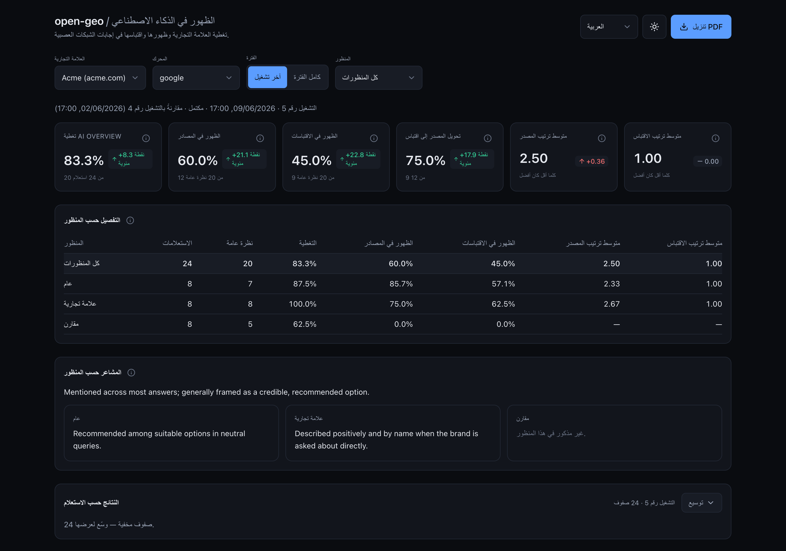

<p align="center">
  
</p>

<p align="center"><a href="README.md">English</a> · <a href="README.ru.md">Русский</a> · <a href="README.zh.md">中文</a> · <a href="README.ar.md">العربية</a></p>

# open-geo — متتبّع ظهور GEO لـ Claude Code

**يقيس open-geo مدى ظهور علامتك التجارية _داخل_ إجابات الذكاء الاصطناعي — عبر كل محرّك رئيسي.**
ينتقل البحث من «عشرة روابط زرقاء» إلى إجابة مُولّدة: ChatGPT وPerplexity وGemini
وClaude ونظرة Google AI العامة وYandex وDeepSeek. تستند كل إجابة إلى حفنة من المصادر — وأن
تكون أحدها **هو** الظهور في الذكاء الاصطناعي. يُمرّر open-geo استعلاماتك عبر محرّك في متصفّح حقيقي
مُسجَّل الدخول، ويسجّل ما إذا كان نطاقك يصل إلى **المصادر**، وإلى
**الاقتباسات**، وإلى **النص** — وكيف يُتحدَّث عن العلامة التجارية حين يصل.

[](https://github.com/Pupok462/open-geo/actions/workflows/ci.yml)
[](https://claude.ai/code)
[](https://www.python.org/)
[](LICENSE)

<p align="center">
  
</p>
<p align="center"><sub>اللوحة على العلامة التجريبية — قمع المؤشرات، التفصيل حسب العدسة، ولوحة صدارة أهم النطاقات.</sub></p>

### لماذا open-geo

- **يقرأ الإجابة كما يقرؤها الإنسان، لا كواجهة برمجية.** يجري الالتقاط عبر Claude-in-Chrome في
  متصفّح حقيقي مُسجَّل الدخول — فيرى إجابة الذكاء الاصطناعي _المُعرَّضة_ (لوحة المصادر ورقائق
  الاقتباس المُضمَّنة)، ويُوحّد النطاقات، ويُصدر سجلًّا واحدًا مُتحقَّقًا منه لكل استعلام. لا تُطابِق
  قراءاتُ الواجهة البرمجية أو الكشط بلا واجهة ما يراه المستخدم المُسجَّل الدخول فعلًا؛ وهذا يطابقه.
- **يتكيّف بدلًا من أن ينكسر.** الالتقاط وكيلٌ يسير وفق دليل بلغة طبيعية
  (`engines/<engine>.md`)، لا محدِّدات مكتوبة بصلابة: حين يغيّر محرّكٌ واجهته يتكيّف الوكيل،
  وأيّ تغيير بنيوي ليس سوى تعديل بضع كلمات في ملف markdown. ولهذا أيضًا تكون إضافة محرّك
  (مثل Yandex / Alice الذي تتخطّاه معظم الأدوات) رخيصة.
- **قمع ظهور، لا درجة استعراضية.** ستة مقاييس تتداخل كقمع — الإجابة →
  المصادر → الاقتباسات — إضافةً إلى قراءة نوعية للنبرة **ولوحة صدارة لأبرز النطاقات** (علامتك
  مقابل كل نطاق آخر في الإجابات). **لا مؤشّر مركّب، ولا حصّة صوت مُختلَقة كمؤشّر.** كل رقم قابل
  للتدقيق مقابل [`pipeline/INTERFACES.md`](pipeline/INTERFACES.md).
- **سلاسل زمنية متعدّدة العلامات التجارية، محليّةٌ أولًا.** تَحُطّ عمليات الالتقاط في قاعدة بيانات SQLite (WAL) محلّية، فتبني
  تاريخًا لكل علامة تجارية ولكل محرّك وفروقًا بين الجولات. المُخرَجات هي **PDF** بسمة بصرية
  و**لوحة معلومات FastAPI + React** بمُبدِّل لغات رباعي. لا SaaS ولا حساب — تُشغّله بنفسك، فمنهجيّته لك تتفحّصها وتعيد إنتاجها.

### لمن هذا

- **مستشارو GEO / SEO** — ادخل العرض التقديمي بقراءة حقيقية _مؤرّخة_ لظهور علامة تجارية في إجابات الذكاء
  الاصطناعي، بدلًا من «بحث الذكاء الاصطناعي مهمّ، ثِق بي».
- **فِرق النموّ / SEO الداخلية في علامة تجارية** — تتبَّع حضور نطاقك في إجابات الذكاء الاصطناعي عبر الزمن،
  مقسّمًا حسب عدسة الاستعلام (عام / مرتبط بالعلامة / مقارن)، والتقِط الانحراف من أسبوع لآخر.
- **الفِرق التي تبني قياسها الخاصّ لظهور الذكاء الاصطناعي** — استخدِم open-geo مرجعًا معياريًّا:
  هل تتطابق مقاييس واجهتك البرمجية / الكشط مع ما تعرضه الإجابة المُعرَّضة فعلًا؟
- **المؤسّسون والمطوّرون المتواجدون أصلًا في Claude Code** — إنّه مجرّد مهارة: وجِّه `/open-geo` إلى ملف CSV
  ونطاق، فتحصل على لوحة معلومات. لا SaaS، ولا رفع، ولا حساب.

## ماذا تحصل

- **التقاط إجابات الذكاء الاصطناعي** — تُمرَّر قائمة استعلامات عبر محرّك في متصفّح حقيقي مُسجَّل
  الدخول، ويُسجَّل كيف يظهر النطاق المستهدف، بسجلٍّ واحد مُتحقَّق منه لكل استعلام.
- **ستة مقاييس + نبرة نوعية** — قمع ظهور (الإجابة → المصادر → الاقتباسات):
  التغطية، ومعدّل ظهور ومتوسّط أفضل موضع للمصادر *و* للاقتباسات، إضافةً إلى
  تحويل المصدر←الاقتباس (`relative_citation`) وملاحظة نصّية حرّة قصيرة عن كيفية معاملة كل
  إجابة للعلامة التجارية. تعرض لوحة المعلومات وملف PDF أيضًا **ملخّص نبرة نوعية لكل عدسة**
  مُركَّبًا من تلك الملاحظات لكل استعلام (انظر **المقاييس**).
- **لوحة صدارة لأبرز النطاقات (المنافسين)** — مقياس متوسّط الموضع مُعمَّمًا من علامتك إلى *كل* نطاق
  يظهر في الإجابات، مرتَّبًا حسب تكرار ظهوره (مع متوسّط موضعه في المصادر/الاقتباسات). إنّها «مَن
  يشاركك فضاء الإجابة» بصدق — منافسو العلامة والناشرون/المجمِّعون سواءً، مع إبراز علامتك — كلوحة قابلة
  للفرز في لوحة المعلومات وقسم في ملف PDF. دون التقاط إضافي: تُحسَب من البيانات التي جمعتها بالفعل،
  فتعمل على الجولات السابقة أيضًا.
- **سلاسل زمنية متعدّدة العلامات التجارية على SQLite** — تُخزَّن كل جولة في `data/aeo.db` (SQLite، WAL)،
  فتُراكِم تاريخًا لكل علامة تجارية + محرّك وتحصل على فروق بين الجولات.
- **لوحة معلومات بمُبدِّل لغات رباعي** — English وРусский و中文 والعربية (مدركة لـ RTL) —
  واجهة برمجية للقراءة فقط بـ FastAPI + واجهة أمامية Vite/React بسمات فاتحة/داكنة وتلميحات لكل مقياس.
- **تقرير PDF** — تقرير A4 مستقلّ بسمة بصرية (ReportLab + matplotlib)، دون
  Chrome بلا واجهة ودون حاجة إلى مكتبات نظام.

## بداية سريعة

‏open-geo هو **مهارة Claude Code** — تُشغّلها من محادثة مع Claude، لا من كومة من
أوامر الصدفة. الإعداد كلّه هو: استنساخ، ثم اطلب من Claude تثبيتها، ثم استخدمها كأمر.

1. **استنسخ المستودع** (أو وجِّه Claude إلى الرابط فحسب):

   ```bash
   git clone <repo> open-geo
   ```

2. **اطلب من Claude إعداده.** في جلسة Claude Code داخل ذلك المجلّد، قل شيئًا مثل:

   > أعِدّ open-geo (شغّل `scripts/setup.sh`)، ثم تتبَّع `example.com` (العلامة التجارية "Example") على `google`
   > باستخدام `examples/questions.csv`.

   يُشغّل Claude التثبيت والالتقاط نيابةً عنك — ويطبع رابط لوحة معلومات وملخّصًا.

3. **أو شغّله مباشرة** كأمر بعد التثبيت:

   ```bash
   /open-geo examples/questions.csv google example.com --brand "Example" --n-worker 3 --output both
   ```

> **`examples/questions.csv` مجرّد عيّنة مبدئية** — مجموعة أسئلة لعلامة تجارية وهمية، موجودة ليعمل التشغيل
> الأول مباشرةً. لقراءة حقيقية، استبدلها بـ**استعلاماتك أنت**: مجموعة الأسئلة هي المُدخَل الأساسي — فهي تحدّد
> *ما الذي يُقاس*، والتقرير جيّد بقدر جودة الأسئلة التي تطرحها. الصيغة وكيفية اختيارها: انظر «ما المُدخَل الذي أحتاجه؟».

**أو ثبِّته كإضافة (plugin) لـ Claude Code** — يسجّل أمر `/open-geo` ووكلاءه العاملين في أي جلسة:

```
/plugin marketplace add Pupok462/open-geo
/plugin install open-geo@open-geo-marketplace
```

> الإضافة مجرّد غلاف للتثبيت: خط المعالجة نفسه ما يزال يعمل من نسخة مستنسخة من المستودع
> (الخطوتان 1–2 أعلاه)، والأمر سيخبرك بذلك صراحةً إذا استُدعي خارجها.

**تتبَّعه وَفق جدول.** غلِّف الأمر داخل **`/loop`** الخاص بـ Claude Code لإعادة الالتقاط على
فترات ومراقبة الانحراف — مثلًا قراءة أسبوعية:

```bash
/loop 1w /open-geo examples/questions.csv google example.com --brand "Example" --output both
```

> الأمر الوحيد الذي لا يستطيع Claude القيام به نيابةً عنك: توصيل إضافة **Claude-in-Chrome** وتسجيل دخول
> المتصفّح إلى السوق الذي تريد تتبّعه. تلك الجلسة المُسجَّلة الدخول هي ما يقوده الالتقاط.

## الأوامر

كل شيء يجري عبر أمر مُشغِّل **واحد** — مهارة **`/open-geo`**. أنت لا تلمس
‏Python: يُنسّق Claude الالتقاط ← المقاييس ← المُخرَجات ويُسلّمك لوحة معلومات و/أو ملف PDF.

```
/open-geo <questions.csv> <engine> <domain> --brand "<name>" --n-worker <N> \
          [--output dashboard|pdf|both] [--period today|all] [--lang en|ru|zh|ar]
```

| argument | المعنى |
|---|---|
| `<questions.csv>` | ملف CSV بالأعمدة **`query,lens`**، حيث `lens ∈ general \| branded \| comparative`. عيّنة جاهزة: `examples/questions.csv`. |
| `<engine>` | أيّ محرّك ذكاء اصطناعي يُتتبَّع (مثل `google`). تقبل الخانة نفسها أيّ محرّك لديه دليل التقاط ضمن `engines/`. |
| `<domain>` | النطاق المستهدف (بأيّ هجاء: `https://www.example.com`، `example.com` — يُوحَّد تلقائيًّا). |
| `--brand "<name>"` | اسم العلامة التجارية البشري (يُستخدَم في عناوين التقرير/لوحة المعلومات والملخّص). |
| `--n-worker <N>` | عدد عمّال الالتقاط المُشغَّلين **بالتوازي** — تزامُن الجولة. |
| `--output` | `dashboard` (افتراضي) \| `pdf` \| `both`. |
| `--period` | `all` (افتراضي — كامل تاريخ العلامة التجارية+المحرّك، يُمكّن الفروق) \| `today` (هذه الجولة فقط). |
| `--lang` | لغة واجهة المُخرَجات — `en` (افتراضي) \| `ru` \| `zh` \| `ar`. |

ما الذي يفعله، من البداية إلى النهاية: يُنشئ جولة ← يُوزّع الاستعلامات على عمّال التقاط **متوازين**
(يقود كلٌّ منهم المحرّك في Chrome المُسجَّل دخولك ويُعيد سجلًّا واحدًا مُتحقَّقًا منه لكل استعلام) ←
يستوعبها ويُسجّل نقاطها مركزيًّا ← يُصدر لوحة المعلومات و/أو ملف PDF ← يطبع ملخّصًا قصيرًا من
صفّ `all` العابر للعدسات. أعِد التشغيل عبر `/loop` لتتبّع الانحراف عبر الزمن.

## كيف يعمل

يُنسَّق المتتبّع كلّه بأمر **`/open-geo`**:

1. **دليل الالتقاط** — يقود **Claude-in-Chrome** دليلًا لكل محرّك (`engines/<engine>.md`) في
   متصفّح Chrome **مرئيّ مُسجَّل الدخول**. يقرأ إجابة الذكاء الاصطناعي المُعرَّضة كما يقرؤها
   نموذج لغوي، ويُوسّع لوحة المصادر ورقائق الاقتباس المُضمَّنة، ويُوحّد النطاقات، ويُصدر
   **كائن `QueryCapture` واحدًا لكل استعلام**.
2. **`QueryCapture`** — عقد الالتقاط المُتحقَّق منه (Pydantic v2؛ المواصفة المرجعية في
   [`pipeline/INTERFACES.md`](pipeline/INTERFACES.md)).
3. **الاستيعاب / تسجيل النقاط** — العمّال **للالتقاط فقط**: يبني كلٌّ منهم سجلّاته ويتحقّق منها
   ذاتيًّا (للقراءة فقط) و**يُعيدها** إلى المُنسِّق. يملك **المُنسِّق (المهارة)**
   وحده كل الكتابة إلى قاعدة البيانات: فيستوعب **جزء كل عامل فور عودته** (تدريجيًّا، فلا يفقد
   أيّ عمل مُلتقَط إذا انهار في المنتصف)، ثم يُنهي الجولة ويحسب المقاييس لكل عدسة إضافةً إلى
   صفّ `all`.
4. **لوحة المعلومات / PDF** — يُصدر المُنسِّق المُخرَج(ات) **أخيرًا**، من المقاييس
   المُخزَّنة، إضافةً إلى ملخّص قصير (لا يُشغَّل خادم لوحة المعلومات إلّا بعد وصول كل عمليات الالتقاط).

السلسلة **محايدة تجاه المحرّك**: `engine` مُعرِّف مفتوح من البداية إلى النهاية (العقد وقاعدة البيانات وواجهة الأوامر
ولوحة المعلومات والتقرير)، ودعم محرّك جديد هو أساسًا دليل `engines/<engine>.md` جديد —
انظر [`engines/README.md`](engines/README.md).

## المقاييس

**القمع، بكلمات بسيطة.** تضيق الأعداد الأربعة عند كل خطوة:

- **الاستعلامات** — الأسئلة التي تُدخِلها (ملف CSV الخاص بك).
- **نظرة AI العامة** — الاستعلامات التي ولّد فيها المحرّك فعلًا إجابة ذكاء اصطناعي (لا يفعل
  ذلك دائمًا — والغياب بيانات صحيحة، لا فشل).
- **في المصادر** — منها، الاستعلامات التي كان فيها نطاقك ضمن **المصادر** التي
  استندت إليها الإجابة.
- **مُقتبَس** — منها، الاستعلامات التي رُبِط/اقتُبِس فيها نطاقك فعلًا في نصّ
  الإجابة.

كل خطوة مجموعة جزئية مما سبقها، فتتداخل الأعداد:
`n_cited ≤ n_in_sources ≤ n_overviews ≤ n_queries`. (الاقتباسات مجموعة جزئية من المصادر لأنّ
النموذج لا يستطيع اقتباس إلّا ما استرجعه.) إنّ **مقام الظهور هو الاستعلامات التي حضرت فيها إجابة**
— لا يمكنك أن تظهر إلّا حيث عُرِضت إجابة فعلًا. يُحسَب كل شيء **لكل عدسة**
(`general` / `branded` / `comparative`) إضافةً إلى صفّ مُجمَّع `all`.

المقاييس الستة ليست سوى نِسَب ومواضع على امتداد ذلك القمع:

- **`overview_coverage`** — حصّة الاستعلامات التي أنتجت إجابة ذكاء اصطناعي من الأساس
  (`n_overviews / n_queries`).
- **`visibility_in_sources`** — من استعلامات الإجابة، الحصّة التي وصل فيها نطاقك إلى
  **المصادر** المُستنَد إليها (`n_in_sources / n_overviews`).
- **`visibility_in_citations`** — من استعلامات الإجابة، الحصّة التي يُقتبَس فيها نطاقك في
  الإجابة (`n_cited / n_overviews`).
- **`avg_source_position`** — متوسّط أفضل رتبة (`min`) لنطاقك بين المصادر، عبر
  الاستعلامات التي يظهر فيها (**الأقلّ أفضل**؛ `—` إن لم يظهر قطّ).
- **`avg_citation_position`** — متوسّط أفضل رتبة (`min`) بين الاقتباسات، عبر الاستعلامات التي
  يُقتبَس فيها (**الأقلّ أفضل**؛ `—` إن لم يُقتبَس قطّ).
- **`relative_citation`** — **تحويل المصدر←الاقتباس**: من الاستعلامات التي
  استُرجِعتَ فيها إلى المصادر، الحصّة التي اقتبسك فيها النموذج فعلًا (`n_cited / n_in_sources`؛
  **الأكثر أفضل**، محدودٌ بـ `[0, 1]`).
- **النبرة** — عبارة **نوعية** قصيرة لكل استعلام تصف كيفية معاملة الإجابة
  للعلامة التجارية. إنّها **نصّ حرّ، لا رقم**. عند الإنهاء، يُجمِّع المُنسِّق أيضًا الملاحظات لكل استعلام
  في **ملخّص لكل عدسة** (سطر قصير واحد لكل عدسة إضافةً إلى تركيب `all`)، يُعرَض كشريط
  «النبرة حسب العدسة» في لوحة المعلومات وكصدارة لقسم النبرة في ملف PDF. وهو
  يتبع لغة البيانات المُلتقَطة، لا `--lang`.

**لوحة صدارة لأبرز النطاقات** (INTERFACES §4.2) ترتّب كل نطاق في الإجابات — مع إبراز علامتك — حسب
تكرار الظهور ومتوسّط الموضع في المصادر/الاقتباسات: سياق تنافسي صادق محسوب من البيانات نفسها. ولا يزال
عمدًا **لا مؤشّر مركّب، ولا حصّة صوت كمؤشّر، ولا نبرة رقمية** — اللوحة مجرّد تكرارات ومواضع لا درجة
مُركَّبة. تُحسَب **الفروق**
بين الجولات وقت القراءة مقابل آخر جولة مكتملة لنفس العلامة التجارية +
المحرّك؛ ولا تُخزَّن. المرجع: [`pipeline/INTERFACES.md`](pipeline/INTERFACES.md) §4.

## مُخرَج نموذجي

تُنتج كل جولة مُخرَجين — **تقرير PDF** بسمة بصرية و**لوحة معلومات** محلّية، كلاهما
مبنيٌّ من نفس الجولة المُسجَّل نقاطها.

**صفحة المقاييس الرئيسية** في ملف PDF (من عرض **Example** التوضيحي المُهيَّأ — المحرّك `google`؛
[نزِّل عيّنة PDF الكاملة](assets/sample-report-example.pdf)):

<p align="center">
  
</p>

**لوحة المعلومات** — بطاقات KPI بفروق وقت القراءة، وتفصيل لكل عدسة، وشريط «النبرة حسب العدسة»،
و**لوحة صدارة «Top domains in answer space»**، ورسم بياني استرجاعي وجدول لكل استعلام، مع مُبدِّل لغات رباعي وسمات
فاتحة/داكنة:

<p align="center">
  
</p>

في نهاية الجولة، يطبع `/open-geo` ملخّصًا رئيسيًّا قصيرًا مبنيًّا من صفّ `lens="all"`
(هنا، عرض Example التوضيحي المُهيَّأ — المحرّك `google`، جولة 2026-06-09):

```
Run for brand "Example" (engine google), queries: 24.
• تغطية نظرة AI العامة: 83% (20 من 24 استعلامًا).
• الظهور في المصادر: 60% من استعلامات النظرة العامة.
• الظهور في الاقتباسات: 45% من استعلامات النظرة العامة.
• متوسّط موضع المصدر: 2.5 (الأقلّ أفضل).
• متوسّط موضع الاقتباس: 1.0 (الأقلّ أفضل).
• تحويل المصدر←الاقتباس (الاقتباس النسبي): 75% (الأكثر أفضل).
```

المقاييس الستة لـ `lens="all"`، مع أعداد القمع الأساسية
(`n_queries = 24` ← `n_overviews = 20` ← `n_in_sources = 12` ← `n_cited = 9`):

| Metric | القيمة | المعنى المبسَّط | الاتجاه |
|---|---|---|---|
| `overview_coverage` | **0.83** (20/24) | حصّة الاستعلامات التي عُرِضت فيها إجابة ذكاء اصطناعي من الأساس | الأكثر = أفضل |
| `visibility_in_sources` | **0.60** (12/20) | من استعلامات الإجابة، الحصّة التي وصل فيها `example.com` إلى المصادر المُستنَد إليها | الأكثر = أفضل |
| `visibility_in_citations` | **0.45** (9/20) | من استعلامات الإجابة، الحصّة التي يُقتبَس فيها النطاق في نصّ الإجابة | الأكثر = أفضل |
| `avg_source_position` | **2.50** | متوسّط أفضل رتبة (`min`) بين المصادر، عبر الاستعلامات التي يظهر فيها | الأقلّ = أفضل |
| `avg_citation_position` | **1.00** | متوسّط أفضل رتبة (`min`) بين الاقتباسات، عبر الاستعلامات التي يُقتبَس فيها | الأقلّ = أفضل |
| `relative_citation` | **0.75** (9/12) | تحويل المصدر←الاقتباس (آخر خطوة في القمع، ∈ `[0, 1]`) | الأكثر = أفضل |

تُعرَض القيمة كـ `—` (لا `0`) حين يتعثّر حارسها — مثلًا لعدسة `comparative` في هذه الجولة
لم يصل النطاق إلى المصادر قطّ، لذا فمقاييس المصدر/الاقتباس الثلاثة كلّها `—`.

## الأسئلة الشائعة

### ما المُدخَل الذي أحتاجه؟
**قائمتك الخاصة من الأسئلة** — **ملف CSV بعمودين، `query,lens`**، حيث `lens ∈ general | branded |
comparative` (`general` = استعلام محايد دون ذكر علامة تجارية؛ `branded` = العلامة التجارية مذكورة صراحةً؛
`comparative` = العلامة التجارية مقابل بدائل). أنت من يكتب هذا الملف، و**هو أهمّ مُدخَل على الإطلاق**: تُقاس
ظهوريّة GEO *نسبةً إلى الأسئلة التي تطرحها*، لذا فإنّ جودة التقرير كلّه بقدر جودة مجموعة الأسئلة. اكتب
الاستعلامات التي قد يكتبها عملاؤك الحقيقيون، موزّعةً بتوازن على الأنواع الثلاثة (يكفي عدد قليل من كلٍّ منها
للبدء). العيّنة المُرفقة [`examples/questions.csv`](examples/questions.csv) ما هي إلا **عيّنة مبدئية** لعلامة
تجارية وهمية — استخدمها لمعرفة الصيغة ثمّ استبدلها بأسئلتك.

**ليس لديك قائمة بعد؟ يستطيع open-geo أن يجمع واحدة لك.** إن لم تُمرِّر ملف CSV، يعرض المُرشد **توليد مجموعة
مؤسَّسة على أدلّة** (حصاد الأسئلة): وكلاء استطلاع فرعيّون يجمعون استعلامات مستخدمين حقيقية مدعومة بإشارات
مُلاحَظة عبر عدّة زوايا على منتجك (الطلب، العرض، الفئة، السمعة، المقارنات)، ثمّ يحذف وكيلٌ مُشكِّك كلّ ما هو
مُختلَق أو موسوم بنوعٍ خاطئ، فتحصل على ملف `query,lens` مع ملف `*_rationale.md` يشرح *لماذا هذه الأسئلة* —
تُراجعه (تطبيق / تعديل / تجاهل) قبل التشغيل. إنّها **مؤسَّسة على أدلّة لا مُختلَقة** (كلّ استعلام يعود إلى
إشارة مُلاحَظة) واختياريّة بالكامل — فملفّك المكتوب يدويًّا مُدخَلٌ من الدرجة الأولى دائمًا. المنهجيّة موثّقة
في [`harvest/METHODOLOGY.md`](harvest/METHODOLOGY.md).

### هل أحتاج أيّ مفاتيح API مدفوعة؟
لا واجهة برمجية لبيانات خارجية ولا مفاتيح مدفوعة. تحتاج إلى **Claude Code**، وإضافة **Claude-in-Chrome**
موصولة، و**متصفّح مُسجَّل الدخول بالفعل** إلى المحرّك / السوق الذي تريد تتبّعه.

### هل هناك خدمة سحابية أو حساب؟
لا. open-geo أداة محلّية: تُخزَّن كل جولة في **قاعدة بيانات SQLite (WAL)** محلّية عند `data/aeo.db`،
والمُخرَجات هي **PDF محلّي** و**لوحة معلومات محلّية** تُشغّلها بنفسك. لا يوجد SaaS ولا حساب، فمنهجيّته
لك تتفحّصها وتعيد إنتاجها. (يجري الالتقاط نفسه عبر Claude Code / Claude-in-Chrome، فهو ليس أداة دون
اتصال / معزولة عن الشبكة.)

### لماذا ستة مقاييس ولا درجة واحدة؟
لأنّها تُشكّل **قمعًا** (الإجابة → المصادر → الاقتباسات)، وطيُّه في رقم واحد
يدعو إلى ترجيح مبهم وخطوط أساس مُختلَقة. كل رقم قابل للتدقيق مقابل صيغة واحدة في
[`pipeline/INTERFACES.md`](pipeline/INTERFACES.md) §4، إضافةً إلى ملاحظة نبرة نصّية حرّة لا تُختزَل
أبدًا إلى رقم. لوحة صدارة لأبرز النطاقات (§4.2) تقدّم سياقًا تنافسيًا كتكرارات + مواضع — لكن لا يزال
لا مؤشّر مركّب ولا حصّة صوت كمؤشّر.

### ما هو `--n-worker`، وكم تستغرق الجولة؟
‏`--n-worker N` هو **تزامُن** الجولة: تُقسَّم الاستعلامات إلى N أجزاء وتُشغَّل N من سُبأَجِنتات الالتقاط
**بالتوازي**، كلٌّ في علامة تبويب/سياق متصفّح خاصّ به. التقاط استعلام واحد يساوي تقريبًا
‏6–10 استدعاءات أدوات، فيتناسب الزمن الفعلي مع عدد الاستعلامات التي يعالجها كل عامل
تتابعًا — ارفع `--n-worker` لتقصير جولة كبيرة (ضمن المعقول، للبقاء تحت رادار
«حركة المرور غير المعتادة» للمحرّك).

## الترخيص

MIT.
