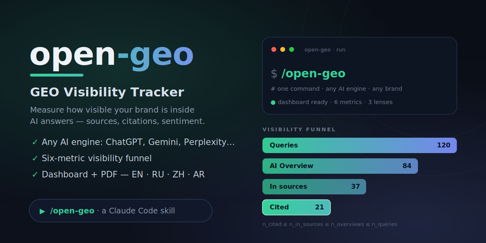
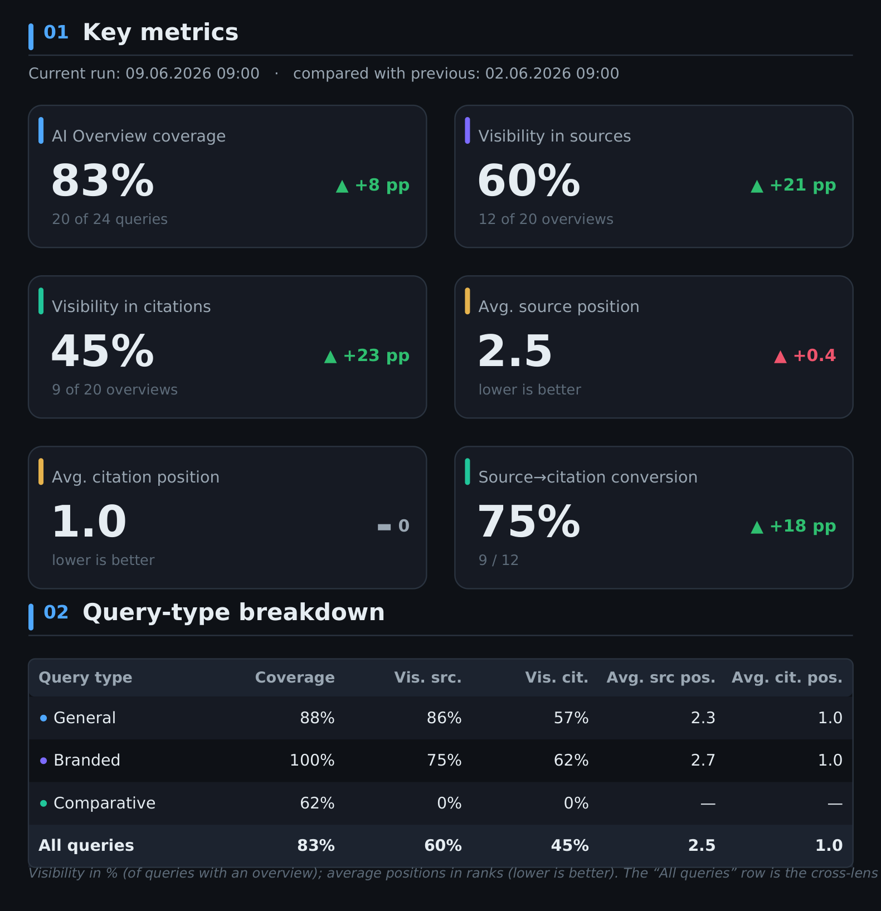
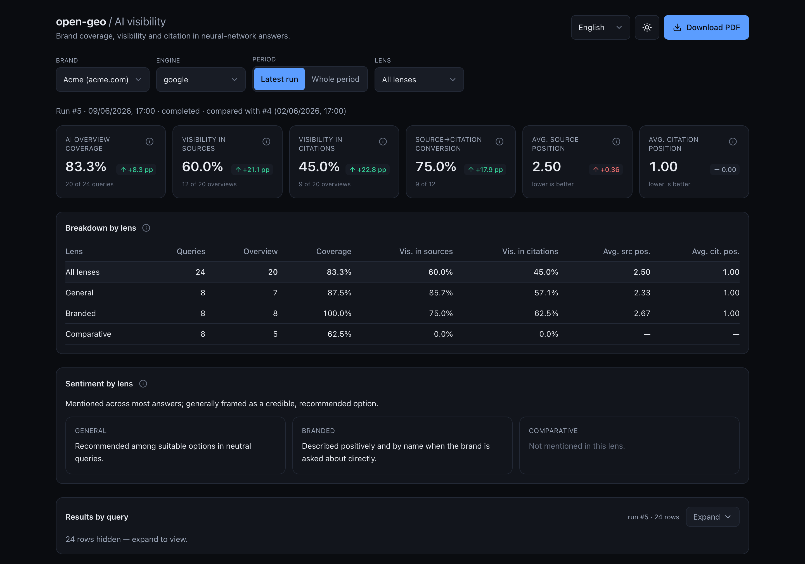

<p align="center">
  
</p>

<p align="center"><a href="README.md">English</a> · <a href="README.ru.md">Русский</a> · <a href="README.zh.md">中文</a> · <a href="README.ar.md">العربية</a></p>

# open-geo — GEO Visibility Tracker for Claude Code

**open-geo measures how visible your brand is _inside_ AI answers — across every major engine.**
Search is shifting from "ten blue links" to a generated answer: ChatGPT, Perplexity, Gemini,
Claude, Google AI Overview, Yandex, DeepSeek. Each answer leans on a handful of sources — and
being one of them **is** visibility in AI. open-geo runs your queries through an engine in a real,
logged-in browser and records whether your domain makes it into the **sources**, into the
**citations**, into the **text** — and how the brand is spoken about when it does.

[](https://github.com/Pupok462/open-geo/actions/workflows/ci.yml)
[](https://claude.ai/code)
[](https://www.python.org/)
[](LICENSE)

### Why open-geo

- **It reads the answer like a human, not an API.** Capture runs through Claude-in-Chrome in a
  real, logged-in browser — it sees the _rendered_ AI answer (the sources panel and the inline
  citation chips), normalizes domains, and emits one validated record per query. No brittle
  scraping of a surface no engine ever promised to keep stable.
- **A visibility funnel, not a vanity score.** Six metrics that nest as a funnel — answer →
  sources → citations — plus a qualitative sentiment read. **No composite index, no made-up
  share-of-voice.** Every number is auditable to [`pipeline/INTERFACES.md`](pipeline/INTERFACES.md).
- **Local-first, multi-brand time-series.** Captures land in a local SQLite (WAL) database, so you
  build per-brand, per-engine history and run-over-run deltas. Deliverables are a themed **PDF** and
  a **FastAPI + React dashboard** with a four-language switcher. Your data never leaves your machine.

### Who this is for

- **GEO / SEO consultants** — walk into a pitch with a real, _dated_ read of a brand's AI-answer
  visibility instead of "AI search matters, trust me."
- **In-house growth / SEO at a brand** — track your own domain's presence in AI answers over time,
  split by query lens (general / branded / comparative), and catch week-over-week drift.
- **Founders & devs already in Claude Code** — it's just a skill: point `/open-geo` at a CSV and a
  domain, get a dashboard. No SaaS, no upload, no account.

## What you get

- **Capture of AI answers** — a list of queries is run through an engine in a real, logged-in
  browser, and how the target domain shows up is recorded, one validated record per query.
- **Six metrics + qualitative sentiment** — a visibility funnel (answer → sources → citations):
  coverage, a visibility rate and an average best position for sources *and* for citations, plus
  the source→citation conversion (`relative_citation`) and a short free-text note on how each
  answer treats the brand. The dashboard and PDF also show a **per-lens qualitative sentiment
  summary** synthesized from those per-query notes (see [Metrics](#metrics)).
- **SQLite multi-brand time-series** — every run is stored in `data/aeo.db` (SQLite, WAL),
  so you accumulate history per brand + engine and get run-over-run deltas.
- **A dashboard with a four-language switcher** — English, Русский, 中文, العربية (RTL-aware) —
  FastAPI read-only API + a Vite/React frontend with light/dark themes and per-metric tooltips.
- **A PDF report** — a self-contained themed A4 report (ReportLab + matplotlib), no headless
  Chrome and no system libraries required.

## Quick start

open-geo is a **Claude Code skill** — you drive it from a chat with Claude, not from a pile of
shell commands. The whole setup is: clone, ask Claude to install it, then use it as a command.

1. **Clone the repo** (or just point Claude at the URL):

   ```bash
   git clone <repo> open-geo
   ```

2. **Ask Claude to set it up.** In a Claude Code session in that folder, say something like:

   > Set up open-geo (run `scripts/setup.sh`), then track `acme.com` (brand "Acme") on `google`
   > using `examples/questions.csv`.

   Claude runs the install and the capture for you — and prints a dashboard link and a summary.

3. **Or run it directly** as a command once installed:

   ```bash
   /open-geo examples/questions.csv google acme.com --brand "Acme" --n-worker 3 --output both
   ```

**Track it on a schedule.** Wrap the command in Claude Code's **`/loop`** to re-capture on an
interval and watch the drift — e.g. a weekly read:

```bash
/loop 1w /open-geo examples/questions.csv google acme.com --brand "Acme" --output both
```

> The one thing Claude can't do for you: connect the **Claude-in-Chrome** extension and log the
> browser in to the market you want to track. That logged-in session is what capture drives.

## Commands

Everything runs through **one** operator command — the **`/open-geo`** skill. You don't touch
Python: Claude orchestrates capture → metrics → deliverables and hands you a dashboard and/or a PDF.

```
/open-geo <questions.csv> <engine> <domain> --brand "<name>" --n-worker <N> \
          [--output dashboard|pdf|both] [--period today|all] [--lang en|ru|zh|ar]
```

| argument | meaning |
|---|---|
| `<questions.csv>` | CSV with columns **`query,lens`**, where `lens ∈ general \| branded \| comparative`. Ready sample: `examples/questions.csv`. |
| `<engine>` | which AI engine to track (e.g. `google`). The same slot takes any engine that has a capture playbook under `engines/`. |
| `<domain>` | the target domain (any spelling: `https://www.acme.com`, `acme.com` — normalized automatically). |
| `--brand "<name>"` | human brand name (used in report/dashboard titles and the summary). |
| `--n-worker <N>` | number of capture workers run **in parallel** — the run's concurrency. |
| `--output` | `dashboard` (default) \| `pdf` \| `both`. |
| `--period` | `all` (default — full brand+engine history, enables deltas) \| `today` (this run only). |
| `--lang` | UI language of the deliverables — `en` (default) \| `ru` \| `zh` \| `ar`. |

What it does, end to end: creates a run → splits the queries across **parallel** capture workers
(each drives the engine in your logged-in Chrome and returns one validated record per query) →
ingests and scores them centrally → emits the dashboard and/or PDF → prints a short summary from
the cross-lens `all` row. Re-run on a [`/loop`](#quick-start) to track drift over time.

## How it works

The whole tracker is orchestrated by the **`/open-geo`** command:

1. **Capture playbook** — a per-engine playbook (`engines/<engine>.md`) is driven by
   **Claude-in-Chrome** in a **visible, logged-in** Chrome. It reads the rendered AI answer as an
   LLM does, expands the sources panel and the inline citation chips, normalizes domains, and emits
   **one `QueryCapture` object per query**.
2. **`QueryCapture`** — the validated capture contract (Pydantic v2; authoritative spec in
   [`pipeline/INTERFACES.md`](pipeline/INTERFACES.md)).
3. **ingest / score** — the workers are **capture-only**: each builds and self-validates its
   records (read-only) and **returns** them to the orchestrator. The **orchestrator (the skill)**
   owns every DB write: it ingests **each chunk as its worker returns** — incrementally, so a
   crash mid-run never loses captured work — finalizes the run, then computes metrics per lens
   plus an `all` row.
4. **dashboard / PDF** — the orchestrator emits the deliverable(s) **last**, from the stored
   metrics, plus a short summary (the dashboard server is started only after all captures are in).

The pipeline is **engine-agnostic**: `engine` is an open id end to end (contract, DB, CLI,
dashboard, report), and supporting a new engine is mainly a new `engines/<engine>.md` playbook —
see [`engines/README.md`](engines/README.md).

## Metrics

**The funnel, in plain words.** The four counts narrow down at each step:

- **Queries** — the questions you feed in (your CSV).
- **AI Overview** — the queries where the engine actually generated an AI answer (it doesn't
  always — and an absence is valid data, not a failure).
- **In sources** — of those, the queries where your domain was among the **sources** the answer
  drew on.
- **Cited** — of those, the queries where your domain was actually **linked/cited** in the answer
  text.

Each step is a subset of the one before it, so the counts nest:
`n_cited ≤ n_in_sources ≤ n_overviews ≤ n_queries`. (Citations are a subset of sources because the
model can only cite what it retrieved.) The **denominator for visibility is answer-present queries**
— you can only be visible where an answer actually rendered. Everything is computed **per lens**
(`general` / `branded` / `comparative`) plus an aggregate `all` row.

The six metrics are just ratios and positions along that funnel:

- **`overview_coverage`** — share of queries that produced an AI answer at all
  (`n_overviews / n_queries`).
- **`visibility_in_sources`** — of answer queries, the share where your domain made it into the
  relied-on **sources** (`n_in_sources / n_overviews`).
- **`visibility_in_citations`** — of answer queries, the share where your domain is **cited** in
  the answer (`n_cited / n_overviews`).
- **`avg_source_position`** — average best (`min`) rank of your domain among sources, over the
  queries where it appears (**lower is better**; `—` if it never appears).
- **`avg_citation_position`** — average best (`min`) rank among citations, over the queries where
  it is cited (**lower is better**; `—` if never cited).
- **`relative_citation`** — the **source→citation conversion**: of the queries where you were
  retrieved into sources, the share where the model actually cited you (`n_cited / n_in_sources`;
  **higher is better**, bounded to `[0, 1]`).
- **sentiment** — a short **qualitative** phrase per query describing how the answer treats the
  brand. It is **free text, not a number**. At finalize the orchestrator also rolls the per-query
  notes into a **per-lens summary** (one short line per lens plus an `all` synthesis), shown as a
  "Sentiment by lens" strip in the dashboard and as the lead of the PDF's sentiment section. It
  follows the language of the captured data, not `--lang`.

There is intentionally **no competitors, no share-of-voice, and no composite index.** **Deltas**
between runs are computed at read-time against the previous completed run of the same brand +
engine; they are not stored. Authority: [`pipeline/INTERFACES.md`](pipeline/INTERFACES.md) §4.

## Sample output

Every run produces two deliverables — a themed **PDF report** and a local **dashboard**, both
built from the same scored run.

The PDF's **key-metrics page** (from the seeded **Acme** demo — engine `google`;
[download the full sample PDF](assets/sample-report-acme.pdf)):

<p align="center">
  
</p>

The **dashboard** — KPI cards with read-time deltas, the per-lens breakdown, a "Sentiment by lens"
strip, a retrospective chart and a per-query table, with a four-language switcher and light/dark
themes:

<p align="center">
  
</p>

At the end of a run, `/open-geo` prints a short headline summary built from the `lens="all"` row
(here, the seeded Acme demo — engine `google`, run of 2026-06-09):

```
Run for brand "Acme" (engine google), queries: 24.
• AI Overview coverage: 83% (20 of 24 queries).
• Visibility in sources: 60% of overview queries.
• Visibility in citations: 45% of overview queries.
• Average source position: 2.5 (lower is better).
• Average citation position: 1.0 (lower is better).
• Source→citation conversion (relative citation): 75% (higher is better).
```

The six metrics for `lens="all"`, with the underlying funnel counts
(`n_queries = 24` → `n_overviews = 20` → `n_in_sources = 12` → `n_cited = 9`):

| Metric | Value | Plain meaning | Direction |
|---|---|---|---|
| `overview_coverage` | **0.83** (20/24) | Share of queries where an AI answer rendered at all | higher = better |
| `visibility_in_sources` | **0.60** (12/20) | Of answer queries, share where `acme.com` made it into the relied-on sources | higher = better |
| `visibility_in_citations` | **0.45** (9/20) | Of answer queries, share where the domain is cited in the answer prose | higher = better |
| `avg_source_position` | **2.50** | Average best (`min`) rank among sources, over queries where it appears | lower = better |
| `avg_citation_position` | **1.00** | Average best (`min`) rank among citations, over queries where it is cited | lower = better |
| `relative_citation` | **0.75** (9/12) | Source→citation conversion (last funnel step, ∈ `[0, 1]`) | higher = better |

A value renders as `—` (not `0`) when its guard trips — e.g. for the `comparative` lens in this run
the domain never reached sources, so the three source/citation metrics are all `—`.

## Caveats (honest)

- **Capture is visible and effectively manual per session** — it runs through a **logged-in**
  Chrome (Claude-in-Chrome), not a headless scraper. The session is left untouched (no
  incognito/logout/account switch), since the AI answer depends on the account and locale.
- **The answer surface is non-deterministic** — the same query can return a different answer or
  none at all. open-geo captures what rendered *right now* and does not retry hoping for a "better"
  answer. Absence is **valid data** (`overview_present=false`) that feeds coverage — not a failure.
- **`--n-worker` workers run in parallel.** The queries are split into N chunks and the N capture
  sub-agents run concurrently, each in its own browser tab/context; `--n-worker` is the run's
  concurrency.
- **reCAPTCHA / "unusual traffic" risk** under load: on a challenge, capture **stops** and asks the
  human to solve it in the open Chrome window rather than hammering the engine.
- **ToS gray area** — automating a search/answer engine sits in a gray area of its terms of service.
  Use a **dedicated account**, keep volume low, and treat this as a measurement tool, not a scraper.

## FAQ

### What input do I need?
A **CSV with two columns, `query,lens`**, where `lens ∈ general | branded | comparative` (`general`
= neutral query with no brand named; `branded` = brand explicitly named; `comparative` = brand vs
alternatives). A ready sample ships at [`examples/questions.csv`](examples/questions.csv).

### Do I need any paid API keys?
No external data API and no paid keys. You need **Claude Code**, the **Claude-in-Chrome** extension
connected, and a **browser already logged in** to the engine / market you want to track.

### Does my data leave my machine?
No. Every run is stored in a local **SQLite (WAL) database** at `data/aeo.db`, and the deliverables
are a **local PDF** and a **local dashboard** you run yourself. There is no SaaS, no upload, and no
account.

### Why six metrics and no single score?
Because they form a **funnel** (answer → sources → citations), and collapsing it into one number
invites hand-wavy weighting and invented baselines. Every number is auditable to one formula in
[`pipeline/INTERFACES.md`](pipeline/INTERFACES.md) §4, plus a free-text sentiment note that is never
reduced to a number. No composite index, no competitors, no share-of-voice.

### What is `--n-worker`, and how long does a run take?
`--n-worker N` is the run's **concurrency**: the queries are split into N chunks and N capture
sub-agents run **in parallel**, each in its own browser tab/context. A single-query capture is
roughly 6–10 tool calls, so wall-clock time scales with how many queries each worker handles in
sequence — raise `--n-worker` to shorten a large run (within reason, to stay under the engine's
"unusual traffic" radar).

## License

MIT.
