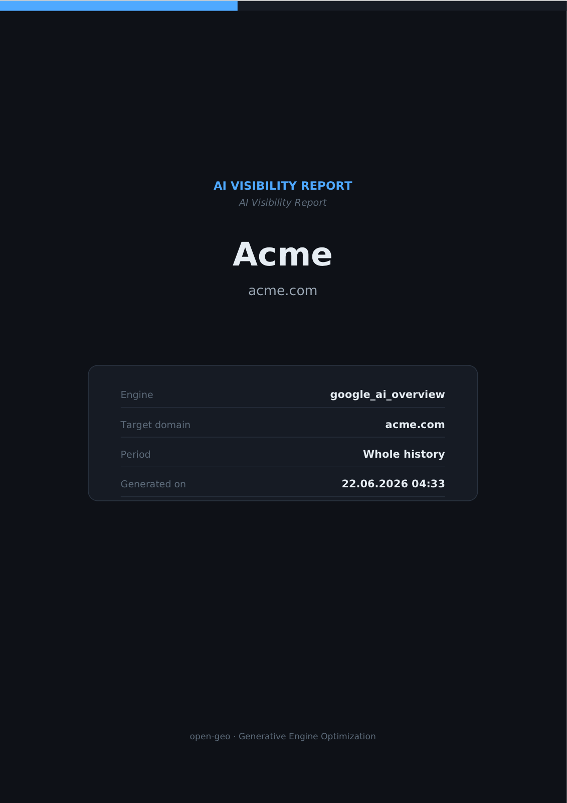

<p align="center">
  
</p>

<p align="center"><a href="README.md">English</a> · <a href="README.ru.md">Русский</a></p>

# open-geo — GEO Visibility Tracker for Claude Code

**open-geo measures how visible your brand is _inside_ AI answers.** Search is shifting from
"ten blue links" to a generated answer — Google's AI Overview first — and that answer leans on a
few sources. Being one of them **is** visibility in AI. open-geo runs your queries through the
engine in a real, logged-in browser and records whether your domain makes it into the
**sources**, into the **citations**, into the **text** — and how the brand is spoken about when
it does.

[](https://github.com/Pupok462/open-geo/actions/workflows/ci.yml)
[](https://claude.ai/code)
[](https://www.python.org/)
[](#testing--ci)
[](LICENSE)
[](ROADMAP.md)

> **Scope today — read this first.** open-geo captures **Google AI Overview only**, and capture is
> **visible and effectively manual**: it drives a real, logged-in Chrome via Claude-in-Chrome, not
> a headless scraper. Multi-engine capture (ChatGPT, Perplexity, Gemini, Yandex …) is the **top of
> the [roadmap](ROADMAP.md)**, not a shipped feature. The pipeline, metrics, dashboard and PDF are
> production-grade (858 + 358 tests, CI-gated); the live capture is early. Full list in
> [Caveats](#caveats-honest).

### Why open-geo

- **It reads the answer like a human, not an API.** Capture runs through Claude-in-Chrome in a
  real, logged-in browser — it sees the _rendered_ AI Overview (the sources panel and the inline
  citation chips), normalizes domains, and emits one validated record per query. No brittle
  scraping of a surface Google never promised to keep stable.
- **A visibility funnel, not a vanity score.** Six metrics that nest as a funnel — overview →
  sources → citations — plus a free-text sentiment note. **No composite index, no made-up
  share-of-voice.** Every number is auditable to [`pipeline/INTERFACES.md`](pipeline/INTERFACES.md).
- **Local-first, multi-brand time-series.** Captures land in a local SQLite (WAL) database, so you
  build per-brand, per-engine history and run-over-run deltas. Deliverables are a themed **PDF** and
  a **FastAPI + React dashboard** with an **EN/RU** switcher. Your data never leaves your machine.

### Who this is for

- **GEO / SEO consultants** — walk into a pitch with a real, _dated_ read of a brand's Google
  AI-Overview visibility instead of "AI search matters, trust me."
- **In-house growth / SEO at a brand** — track your own domain's AI-Overview presence over time,
  split by query lens (general / branded / comparative), and catch week-over-week drift.
- **Founders & devs already in Claude Code** — it's just a skill: point `/open-geo` at a CSV and a
  domain, get a dashboard. No SaaS, no upload, no account.

## What you get

- **Daily-ish, manual capture of Google AI Overview** — a list of queries is run through one
  engine in a real, logged-in browser, and how the target domain shows up is recorded.
- **Six metrics + qualitative sentiment** — a visibility funnel (overview → sources →
  citations): coverage, a visibility rate and an average best position for sources *and* for
  citations, plus the source→citation conversion (`relative_citation`) and a short free-text
  note on how each answer treats the brand (see [Metrics](#metrics)).
- **SQLite multi-brand time-series** — every run is stored in `data/aeo.db` (SQLite, WAL),
  so you accumulate history per brand + engine and get run-over-run deltas.
- **A dashboard with an EN/RU language switcher** (extensible to more languages) — FastAPI
  read-only API + a Vite/React frontend with light/dark themes and per-metric tooltips.
- **A PDF report** (`--lang en|ru`) — a self-contained themed A4 report (ReportLab +
  matplotlib), no headless Chrome and no system libraries required.

> Three further features live in the backlog and are **not implemented**: tracking the
> **other popular AI answer engines** (ChatGPT, Perplexity, Gemini, Claude, Yandex, DeepSeek,
> …) beyond Google AI Overview; SEO-question harvesting → natural LLM prompts; and a domain
> GEO-audit gate. Specs are in [ROADMAP.md](ROADMAP.md).

## Quick start

**Install as a Claude Code plugin** (Claude Code 1.0.33+):

```bash
/plugin marketplace add Pupok462/open-geo
/plugin install open-geo@open-geo-marketplace
```

**See it on demo data first — no browser, no capture:**

```bash
bash scripts/setup.sh                            # venv + Python deps + npm install
.venv/bin/python -m pipeline.seed_demo --reset   # synthetic multi-run dataset
```

…then open the [dashboard](#dashboard) or render a [PDF](#pdf-report).

**Track a real domain** (inside Claude Code, with Chrome logged in to the target market):

```bash
/open-geo examples/questions.csv google acme.com --brand "Acme" --n-worker 3 --output both
```

## Commands

open-geo is one operator command — the **`/open-geo`** skill — backed by a small, scriptable
CLI (run the Python entry points with the project venv, `.venv/bin/python`). Authoritative
contracts: [`.claude/skills/open-geo/SKILL.md`](.claude/skills/open-geo/SKILL.md) and
[`pipeline/INTERFACES.md`](pipeline/INTERFACES.md).

| Command | What it does |
|---|---|
| `/open-geo <csv> <engine> <domain> --brand "<name>" --n-worker <N> [--output dashboard\|pdf\|both] [--period today\|all] [--lang en\|ru]` | Operator entry point: capture → ingest → aggregate → emit a dashboard and/or PDF, then a short summary. |
| `python -m pipeline.seed_demo --reset` | Seed a synthetic multi-run dataset to explore the dashboard and report without a live capture. |
| `python -m report.generate --brand "<name>" --domain <domain> --engine <engine> [--period today\|all] [--lang en\|ru] --out reports/<name>.pdf` | Render the themed A4 PDF report (ReportLab + matplotlib). |
| `python -m uvicorn dashboard.api:app --host 127.0.0.1 --port 8077` | Start the read-only dashboard API; pair with `npm run dev` in `dashboard/web` (see [Dashboard](#dashboard)). |

> Capture itself is not a separate command — it's the per-engine playbook
> [`engines/google.md`](engines/google.md) that the `/open-geo` skill drives via Claude-in-Chrome.

## How it works

The whole tracker is orchestrated by the **`/open-geo`** command:

1. **Capture playbook** — a per-engine playbook (`engines/<engine>.md`; the first is
   `engines/google.md` for Google AI Overview) is driven by **Claude-in-Chrome** in a
   **visible, logged-in** Chrome. It reads the rendered AI Overview as an LLM does, expands
   the sources panel and the inline citation chips, normalizes domains, and emits **one
   `QueryCapture` object per query**.
2. **`QueryCapture`** — the validated capture contract (Pydantic v2; authoritative spec in
   [`pipeline/INTERFACES.md`](pipeline/INTERFACES.md)).
3. **ingest / aggregate** — the workers are **capture-only**: each builds and self-validates
   its `QueryCapture` objects (read-only) and **returns** them to the orchestrator. The
   **orchestrator (the skill)** collects all returned objects, does **one central ingest**
   (`pipeline.ingest`), **finalizes** the run, then computes metrics per lens plus an `all`
   row (`pipeline.aggregate`).
4. **dashboard / PDF** — the orchestrator emits the deliverable(s) **last**, from the stored
   metrics, plus a short summary (the dashboard server is started by the skill in the
   background, only after all captures are in).

## Metrics

The **denominator for visibility is overview-present queries** (`overview_present`): you can
only be visible where an overview actually rendered. Metrics are computed **per lens**
(`general` / `branded` / `comparative`) plus an aggregate `all` row.

The model is a **funnel**: of all queries, some render an overview; of those, in some the
domain is retrieved into `sources`; of those, in some it is actually cited in the answer.
Because the model can only cite what it retrieved, **citations are a subset of sources**
(capture folds any inline-cited link into `sources` — the visible Google sources panel is
only a partial view of the retrieval set), so the counts nest:
`n_cited ≤ n_in_sources ≤ n_overviews ≤ n_queries`.

- **`overview_coverage`** — share of queries for which an overview rendered at all
  (`n_overviews / n_queries`).
- **`visibility_in_sources`** — of overview queries, the share where the target domain made
  it into `sources`, the relied-on set (`n_in_sources / n_overviews`).
- **`visibility_in_citations`** — of overview queries, the share where the domain is cited in
  the answer (`n_cited / n_overviews`).
- **`avg_source_position`** — average best (`min`) rank of the domain among sources, over the
  queries where it appears (**lower is better**; `—` if it never appears).
- **`avg_citation_position`** — average best (`min`) rank of the domain among citations, over
  the queries where it is cited (**lower is better**; `—` if it is never cited).
- **`relative_citation`** — the **source→citation conversion**: of the queries where you were
  retrieved into `sources`, the share where the model actually cited you
  (`n_cited / n_in_sources`, the last step of the funnel; **higher is better**, bounded to
  `[0, 1]` because citations ⊆ sources).
- **sentiment** — a short **qualitative** phrase per query describing how the answer treats
  the brand. It is **free text, not a number**; it is never aggregated into a metric — the
  report and dashboard show it as-is.

There is intentionally **no competitors, no share-of-voice, and no composite index.**
**Deltas** between runs are computed at read-time (by the report/dashboard) against the
previous completed run of the same brand + engine; they are not stored
(`pipeline/INTERFACES.md` §4.1).

## Sample output

Every run produces two deliverables — a themed **PDF report** and a local **dashboard**. Below
is the PDF cover from the seeded **Acme** demo dataset
([download the full sample PDF](assets/sample-report-acme.pdf)):

<p align="center">
  
</p>

At the end of a run, `/open-geo` prints a short headline summary built from the `lens="all"`
row (here, the seeded Acme demo — engine `google_ai_overview`, run of 2026-06-09, `--lang en`):

```
Run for brand "Acme" (engine google_ai_overview), queries: 24.
• AI Overview coverage: 79% (19 of 24 queries).
• Visibility in sources: 47% of overview queries.
• Visibility in citations: 37% of overview queries.
• Average source position: 2.6 (lower is better).
• Average citation position: 1.0 (lower is better).
• Source→citation conversion (relative citation): 78% (higher is better).
Report: reports/acme_2026-06-09.pdf · Dashboard: http://localhost:5173
```

The six metrics for `lens="all"`, with the underlying funnel counts
(`n_queries = 24` → `n_overviews = 19` → `n_in_sources = 9` → `n_cited = 7`):

| Metric | Value | Plain meaning | Direction |
|---|---|---|---|
| `overview_coverage` | **0.79** (19/24) | Share of queries where an AI Overview rendered at all | higher = better |
| `visibility_in_sources` | **0.47** (9/19) | Of overview queries, share where `acme.com` made it into the relied-on `sources` | higher = better |
| `visibility_in_citations` | **0.37** (7/19) | Of overview queries, share where the domain is cited in the answer prose | higher = better |
| `avg_source_position` | **2.56** | Average best (`min`) rank among sources, over queries where it appears | lower = better |
| `avg_citation_position` | **1.00** | Average best (`min`) rank among citations, over queries where it is cited | lower = better |
| `relative_citation` | **0.78** (7/9) | Source→citation conversion (last funnel step, ∈ `[0, 1]`) | higher = better |

A value renders as `—` (not `0`) when its guard trips — e.g. for the `comparative` lens in this
run the domain never reached `sources`, so `avg_source_position`, `avg_citation_position` and
`relative_citation` are all `—`.

> Deltas are shown against the **previous completed run** of the same brand + engine, computed at
> read-time (not stored). Versus the prior run here, `visibility_in_sources` (0.21 → 0.47),
> `visibility_in_citations` (0.05 → 0.37) and `relative_citation` (0.25 → 0.78) all rose, while
> `avg_source_position` drifted 2.0 → 2.56 (slightly worse, since lower is better).

## Prerequisites

- **Python 3.11** — pipeline, report, and the dashboard backend (a `.venv` from
  `requirements.txt`).
- **Node.js 20+** — only for the dashboard frontend (Vite + React + TypeScript + Tailwind +
  Recharts).
- **Claude-in-Chrome** extension/MCP connected **and a logged-in browser** — capture is
  **visible and manual**, driven through a logged-in Chrome session (not headless). AI
  Overview depends on who is logged in and on the locale, so the session is left as-is (no
  incognito, no logout).

## Install

The robust path (the repo ships `scripts/setup.sh`, which creates the venv, installs the
Python deps, and runs `npm install` for the frontend):

```bash
git clone <repo> open-geo
cd open-geo
bash scripts/setup.sh
```

Then connect the **Claude-in-Chrome** extension and make sure Chrome is **logged in** to the
Google account whose market you want to track — capture runs in that visible browser.

> **Alternative — install as a Claude Code plugin.** This repo also ships a plugin manifest
> under `.claude-plugin/`, so you can add it via `/plugin` and get the `/open-geo` skill
> without cloning manually. The same browser prerequisite applies.

### Install & use in another Claude chat

A common way to use open-geo is to hand it to Claude in a fresh chat. Tell Claude something
like:

> Clone `<repo>`, run `bash scripts/setup.sh`, then use the `/open-geo` skill to track my
> domain `acme.com` (brand "Acme") against `examples/questions.csv` on `google`.

Claude clones the repo, runs the setup script, and the `/open-geo` skill becomes available as
the operator entry point. Make sure the Claude-in-Chrome extension is connected and the
browser is logged in first — that is the one thing Claude cannot do for you.

## Usage

### The `/open-geo` command (operator entry point)

```
/open-geo <questions.csv> <engine> <domain> --brand "Acme" --n-worker <N> \
          [--output dashboard|pdf|both] [--period today|all] [--lang en|ru]
```

| argument | meaning |
|---|---|
| `<questions.csv>` | CSV with columns **`query,lens`**, where `lens ∈ general \| branded \| comparative`. Ready sample: `examples/questions.csv`. |
| `<engine>` | engine id; equals the capture playbook's basename, e.g. `google` ↔ `engines/google.md`. Written into every `QueryCapture` and selects the capture playbook `engines/<engine>.md`. |
| `<domain>` | the target domain (any spelling: `https://www.acme.com`, `acme.com` — normalized automatically). |
| `--brand "<name>"` | human brand name (used in report/dashboard titles and the summary). |
| `--n-worker <N>` | number of capture workers run **in parallel** — the run's concurrency. |
| `--output` | `dashboard` (default) \| `pdf` \| `both`. |
| `--period` | `all` (default — full brand+engine history, enables deltas) \| `today` (this run only). |
| `--lang` | `en` (default) \| `ru` — UI language for the deliverables: the PDF report language and the dashboard's default language. |

Step by step the command: creates a run → splits the queries across **capture-only** workers,
each of which drives the engine via the playbook and **captures and returns** its
`QueryCapture` objects (the workers never ingest or touch the DB) → the skill **ingests the
collected batch centrally** (`pipeline.ingest`) → finalizes the run → computes metrics
(`pipeline.aggregate`) → emits the dashboard and/or PDF **last** → prints a short summary from
the `lens="all"` row. Details in
[`.claude/skills/open-geo/SKILL.md`](.claude/skills/open-geo/SKILL.md).

> **Step 0 (pre-gate) is a no-op.** The command reserves a slot for a future domain
> GEO-audit gate (ROADMAP Feature 2). In v1 nothing is called and the run is never blocked.

### Demo data

A synthetic multi-run dataset (handy to see the report and dashboard without a real capture):

```bash
.venv/bin/python -m pipeline.seed_demo --reset
```

`--reset` deletes `data/aeo.db` (and its `-wal`/`-shm`) before seeding. It creates several
runs on different dates, each with all the edge cases (no overview; domain absent; domain at
multiple positions; a zero-visibility lens to exercise the guards).

### PDF report

```bash
.venv/bin/python -m report.generate \
  --brand "Acme" --domain acme.com --engine google \
  --period all --lang en --out reports/acme.pdf
```

A self-contained themed A4 PDF (ReportLab + matplotlib, no headless Chrome / no system
libraries): a cover, KPI cards with deltas vs the previous run, the lens breakdown,
the visibility funnel (sources / citations), a per-run trend when `--period all`,
and a qualitative-sentiment block (representative phrasings as-is). `--lang en|ru` sets the
report language (default `en`). `--period today` is the latest run; `--period all` adds the
time-series.

### Dashboard

The backend (FastAPI, read-only over `data/aeo.db`) and the frontend (Vite dev server) run as
two processes **from the repo root**:

```bash
# 1) API (read-only). Pick a free port — 8000 is often busy on this machine:
OPEN_GEO_DB=data/aeo.db .venv/bin/python -m uvicorn dashboard.api:app \
    --host 127.0.0.1 --port 8077

# 2) Frontend (separate terminal):
cd dashboard/web && npm run dev      # http://localhost:5173
```

- The DB path comes from the **`OPEN_GEO_DB`** env var (default `data/aeo.db`).
- **Local port 8000 is often already taken** — pick another (e.g. `8077`) and point the
  frontend at it with `VITE_API_BASE=http://127.0.0.1:8077 npm run dev` (the API serves
  permissive CORS, so a cross-origin base works without the proxy).
- The dashboard shows metrics per brand/engine: KPI cards with read-time deltas, the lens
  breakdown, a retrospective chart, a per-query table, and a PDF export. It has light/dark
  themes and an **EN/RU language switcher** (and per-metric `(i)` tooltips). Endpoints and
  details: [`dashboard/README.md`](dashboard/README.md).

## Languages / i18n

The interface (dashboard + PDF report) is fully **internationalized and extensible** — all
user-facing strings live in `i18n/` (English is the canonical locale). **To add a language:**

1. Copy `i18n/en.json` → `i18n/<code>.json` (e.g. `i18n/de.json`) and translate the values,
   keeping every key and every `{placeholder}` verbatim.
2. Add it to `i18n/locales.json`: `{ "code": "<code>", "name": "<native display name>" }`.
3. Done — it appears in the dashboard switcher automatically and works via
   `report --lang <code>`. Missing keys fall back to English per key, so a partial
   translation never breaks the UI.

See [`i18n/README.md`](i18n/README.md) for the full model. (Note: only UI chrome is
translated — captured data such as query text, sentiment, domains, and brand names is shown
as-is. UI language is independent of the capture market.)

## Project structure

```
open-geo/
├── pipeline/                # Python core (Pydantic v2 + SQLite WAL)
│   ├── schema.py            #   QueryCapture / Link contract + normalize_domain
│   ├── db.py                #   SQLite (WAL) layer: brands/runs/results/metrics
│   ├── ingest.py            #   CLI: create a run / ingest & validate a batch
│   ├── aggregate.py         #   CLI: compute metrics per lens + "all"
│   ├── seed_demo.py         #   CLI: synthetic demo data
│   └── INTERFACES.md        #   authoritative contract (fields, DB, formulas)
├── engines/
│   ├── README.md            # capture-playbook pattern + how to add an engine (multi-engine)
│   └── google.md            # Google AI Overview capture playbook (Claude-in-Chrome)
├── report/
│   ├── generate.py          # themed PDF (ReportLab + matplotlib), --lang en|ru
│   ├── i18n.py              #   loads i18n/<lang>.json merged over en.json
│   └── _selftest_fixture.py #   throwaway DB for the report self-test
├── dashboard/
│   ├── api.py               # FastAPI, read-only over data/aeo.db (+ /api/i18n)
│   ├── seed_fixture.py      #   seeds a throwaway fixture DB for dashboard self-test
│   ├── web/                 # Vite + React + TS + Tailwind + Recharts (+ Vitest tests)
│   └── README.md            # run commands, endpoints, EN/RU switcher
├── i18n/                    # UI strings: en.json (canonical), ru.json, locales.json
├── .claude/skills/open-geo/
│   └── SKILL.md             # the /open-geo command orchestrator
├── examples/questions.csv   # sample input CSV (query,lens)
├── tests/                   # pytest suite (858 tests) — schema, db, ingest,
│                            #   aggregate, seed, report, dashboard API, fixtures
├── conftest.py              # shared pytest fixtures (throwaway DBs, API client)
├── pyproject.toml           # pytest + coverage.py (branch) config
├── .github/workflows/ci.yml # CI: pytest + vitest with a strict 95% coverage gate
├── data/aeo.db              # working DB (SQLite, WAL) — created by the pipeline
├── scripts/setup.sh         # venv + Python deps + npm install
├── requirements.txt
├── ROADMAP.md               # backlog feature specs
└── CLAUDE.md                # working notes for AI agents
```

## Testing & CI

Two test suites, both gated at **95% coverage** in CI ([`.github/workflows/ci.yml`](.github/workflows/ci.yml)).

**Python** — 858 tests (pytest, branch coverage), currently **100%** across
`pipeline/`, `report/`, and `dashboard/`:

```bash
.venv/bin/python -m pytest                                   # run the suite
.venv/bin/python -m pytest --cov --cov-report=term-missing   # with coverage
```

**Frontend** — 358 tests (Vitest + Testing-Library, v8 coverage) over the
React/TS dashboard:

```bash
cd dashboard/web
npm run test:run    # run the suite
npm run coverage    # with coverage
```

On every push / pull request, CI runs both suites, prints the coverage tables to
the GitHub **job summary**, uploads the reports (`coverage.xml`, `lcov.info`) as
artifacts, and **fails the build if coverage drops below 95%**.

## Caveats (honest)

- **Capture is visible and effectively manual per session** — it runs through a **logged-in**
  Chrome (Claude-in-Chrome). The session is left untouched (no incognito/logout/account
  switch), since AI Overview depends on the account and locale.
- **Google AI Overview only, for now** — tracking the other AI answer engines (ChatGPT,
  Perplexity, Gemini, Claude, Yandex, DeepSeek, …) is on the roadmap (ROADMAP Feature 3). The
  pipeline is already engine-agnostic, so each new engine is mainly a new
  `engines/<engine>.md` playbook plus a little per-engine modeling — see
  [`engines/README.md`](engines/README.md). The **AI Overview surface is non-deterministic**:
  the same query can return a different overview or none at all. open-geo captures what
  rendered *right now* and does not retry hoping for a "better" overview. Absence is **valid
  data** (`overview_present=false`) that feeds coverage — not a failure.
- **`--n-worker` workers run in parallel.** The queries are split into N chunks and the N
  capture sub-agents run concurrently, each in its own browser tab/context; `--n-worker` is
  the run's concurrency.
- **reCAPTCHA / "unusual traffic" risk** under load: on a challenge, capture **stops** and
  asks the human to solve it in the open Chrome window rather than hammering Google.
- **ToS gray area** — automating a search engine sits in a gray area of its terms of service.
  Use a **dedicated account**, keep volume low, and treat this as a measurement tool, not a
  scraper.

## FAQ

### Which AI engines does open-geo support?
**Google AI Overview only, today.** That is the one shipped capture playbook (`engines/google.md`).
The other popular AI answer engines — ChatGPT, Perplexity, Gemini, Claude, Yandex (Neuro),
DeepSeek — are on the [roadmap](ROADMAP.md) (Feature 3), not shipped. The pipeline is already
engine-agnostic (the `engine` field is an open string everywhere), so adding one is mainly a new
`engines/<engine>.md` playbook plus a little per-engine modeling — but until that playbook exists,
passing another engine id will stop the run.

### Is capture headless? Can it run unattended?
No. Capture drives a **visible, logged-in Chrome** through Claude-in-Chrome — not a headless
scraper. AI Overview depends on who is logged in and on the locale, so the session is left
untouched (no incognito, no logout, no account switch). It is also not a retry-until-better loop:
the AI Overview surface is non-deterministic, and the **absence** of an overview is valid data
(`overview_present=false`) that feeds `overview_coverage` — open-geo records what rendered right
now rather than re-querying hoping for a "better" answer.

### Does my data leave my machine?
No. Every run is stored in a local **SQLite (WAL) database** at `data/aeo.db`, and the deliverables
are a **local PDF** and a **local dashboard** (a read-only FastAPI API plus a Vite/React frontend
you run yourself). There is no SaaS, no upload, and no account.

### What are the six metrics, and why is there no single score?
They form a **funnel**: `overview_coverage` (an overview rendered), then for the target domain
`visibility_in_sources` and `visibility_in_citations` (rates), `avg_source_position` and
`avg_citation_position` (best-rank averages, lower is better), and `relative_citation` (the
source→citation conversion). The counts nest as `n_cited ≤ n_in_sources ≤ n_overviews ≤ n_queries`.
There is deliberately **no composite index, no competitors, and no share-of-voice** — those invite
hand-wavy weighting and invented baselines. Every number is auditable to one formula in
[`pipeline/INTERFACES.md`](pipeline/INTERFACES.md) §4, plus a free-text sentiment note that is
never reduced to a number.

### What is `relative_citation`, and why are citations a subset of sources?
A model can only cite what it actually retrieved, so **citations ⊆ sources**. During capture, any
inline-cited link is folded into `sources` (the visible Google "sources panel" is only a partial
view of the retrieval set). `relative_citation = n_cited / n_in_sources` is therefore the **last
step of the funnel** — of the queries where your domain was retrieved into `sources`, the share
where the model went on to cite it in the prose. Because citations are a subset of sources the
ratio is bounded to `[0, 1]`, and higher is better.

### Is automating Google against its Terms of Service?
It sits in a **gray area** of search-engine terms of service. Treat open-geo as a measurement
tool, not a scraper: use a **dedicated account**, keep volume low, and don't hammer the engine. If
Google shows a reCAPTCHA or an "unusual traffic" challenge, capture **stops** and asks the human to
solve it in the open Chrome window — it never tries to solve the challenge, retry in a loop, or
spin up fresh tabs to get around it.

### What input do I need?
A **CSV with two columns, `query,lens`**, where `lens ∈ general | branded | comparative` (`general`
= neutral query with no brand named; `branded` = brand explicitly named; `comparative` = brand vs
alternatives). A ready sample ships at [`examples/questions.csv`](examples/questions.csv).

### Do I need any paid API keys?
No external data API and no paid keys. You need **Claude Code**, the **Claude-in-Chrome** extension
connected, and a **browser already logged in** to the Google account / market you want to track.
(Python 3.11 for the pipeline / report / API, Node 20+ only for the dashboard frontend.)

### What languages are supported?
The UI chrome — the dashboard and the PDF report — ships in **English and Russian** and is
extensible: drop an `i18n/<code>.json` file and it appears in the dashboard switcher and works via
`report --lang <code>` (missing keys fall back to English). Only the interface is translated;
**captured data** (query text, sentiment, domains, brand names) is shown as-is. UI language is
independent of the capture market.

### What is `--n-worker`, and how long does a run take?
`--n-worker N` is the run's **concurrency**: the queries are split into N chunks and N capture
sub-agents run **in parallel**, each in its own browser tab/context. A single-query capture is
roughly 6–10 tool calls with no navigation away from Google, so wall-clock time scales with how
many queries each worker handles in sequence — raise `--n-worker` to shorten a large run (within
reason, to stay under Google's "unusual traffic" radar).

## License

MIT.
