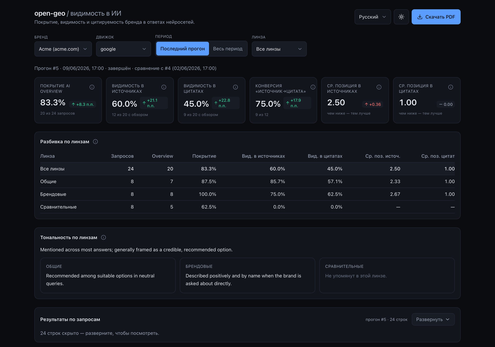

<p align="center">
  
</p>

<p align="center"><a href="README.md">English</a> · <a href="README.ru.md">Русский</a> · <a href="README.zh.md">中文</a> · <a href="README.ar.md">العربية</a></p>

# open-geo — трекер GEO-видимости для Claude Code

**open-geo измеряет, насколько ваш бренд виден _внутри_ AI-ответов — по всем основным движкам.**
Поиск смещается от «десяти синих ссылок» к сгенерированному ответу: ChatGPT, Perplexity, Gemini,
Claude, Google AI Overview, Yandex, DeepSeek. Каждый ответ опирается на горстку источников — и
быть одним из них **и есть** видимость в AI. open-geo прогоняет ваши запросы через движок в
настоящем залогиненном браузере и фиксирует, попадает ли ваш домен в **источники**, в
**цитаты**, в **текст** — и как о бренде говорят, когда он туда попадает.

[](https://github.com/Pupok462/open-geo/actions/workflows/ci.yml)
[](https://claude.ai/code)
[](https://www.python.org/)
[](LICENSE)

### Почему open-geo

- **Он читает ответ как человек, а не как API.** Захват идёт через Claude-in-Chrome в
  настоящем залогиненном браузере — он видит _отрендеренный_ AI-ответ (панель источников и встроенные
  чипы-цитаты), нормализует домены и выдаёт одну валидированную запись на запрос. Замер через API и
  headless не совпадает с тем, что реально видит залогиненный пользователь; этот — совпадает.
- **Адаптируется, а не ломается.** Захват — это агент, идущий по плейбуку на естественном языке
  (`engines/<engine>.md`), а не захардкоженные селекторы: когда движок меняет вёрстку, агент
  подстраивается, а структурное изменение — это правка пары слов в markdown-файле. Поэтому и
  добавить движок (тот же Yandex/Алиса, который большинство инструментов пропускает) — дёшево.
- **Воронка видимости, а не тщеславная метрика.** Шесть метрик, вложенных как воронка: ответ →
  источники → цитаты — плюс качественная оценка тональности **и лидерборд топ-доменов** (ваш бренд
  против всех остальных доменов в ответах). **Никакого сводного индекса, никакого выдуманного
  share-of-voice как индекса.** Каждое число проверяемо по [`pipeline/INTERFACES.md`](pipeline/INTERFACES.md).
- **Local-first, мультибрендовая тайм-серия.** Захваты ложатся в локальную базу SQLite (WAL), так что вы
  накапливаете историю по бренду и по движку и считаете дельты от прогона к прогону. Деливераблы — тематический **PDF** и
  **дашборд на FastAPI + React** с переключателем на четыре языка. Нет SaaS и нет аккаунта — вы запускаете его сами, поэтому методику видно и её можно воспроизвести.

### Кому это пригодится

- **GEO / SEO-консультантам** — приходите на питч с реальным, _датированным_ срезом видимости бренда в
  AI-ответах вместо «AI-поиск важен, поверьте на слово».
- **In-house growth / SEO внутри бренда** — отслеживайте присутствие собственного домена в AI-ответах во времени,
  с разбивкой по линзам запросов (general / branded / comparative), и ловите дрейф неделя к неделе.
- **Командам, строящим свой замер AI-видимости** — используйте open-geo как эталон: коррелирует ли
  ваш API-/скрейпинг-пайплайн с тем, что реально показывает отрендеренный ответ?
- **Основателям и разработчикам, уже работающим в Claude Code** — это просто скилл: направьте `/open-geo` на CSV и
  домен, получите дашборд. Никакого SaaS, никакой загрузки, никаких аккаунтов.

## Что вы получаете

- **Захват AI-ответов** — список запросов прогоняется через движок в настоящем залогиненном
  браузере, и фиксируется, как там показывается целевой домен, — одна валидированная запись на запрос.
- **Шесть метрик + качественная тональность** — воронка видимости (ответ → источники → цитаты):
  покрытие, доля видимости и средняя лучшая позиция для источников *и* для цитат, плюс
  конверсия источник→цитата (`relative_citation`) и короткая текстовая заметка о том, как каждый
  ответ относится к бренду. Дашборд и PDF также показывают **сводку качественной тональности по линзам**,
  синтезированную из этих заметок по каждому запросу (см. **Метрики**).
- **Лидерборд топ-доменов (конкурентов)** — метрика средней позиции, обобщённая с вашего бренда на
  *каждый* домен в ответах, ранжированный по частоте появления (со средней позицией в источниках/цитатах).
  Честное «кто делит с вами выдачу» — и конкуренты-бренды, и площадки/издатели, с подсветкой вашего
  бренда — как сортируемая панель в дашборде и секция в PDF. Без повторного захвата: считается из уже
  собранных данных, поэтому работает и по прошлым прогонам.
- **Мультибрендовая тайм-серия в SQLite** — каждый прогон сохраняется в `data/aeo.db` (SQLite, WAL),
  так что вы накапливаете историю по бренду + движку и получаете дельты от прогона к прогону.
- **Дашборд с переключателем на четыре языка** — English, Русский, 中文, العربية (с поддержкой RTL) —
  read-only API на FastAPI + фронтенд на Vite/React со светлой/тёмной темами и тултипами по каждой метрике.
- **PDF-отчёт** — самодостаточный тематический A4-отчёт (ReportLab + matplotlib), без headless-
  Chrome и без системных библиотек.

## Быстрый старт

open-geo — это **скилл Claude Code**: вы управляете им из чата с Claude, а не из кучи
shell-команд. Вся настройка — это: склонировать, попросить Claude установить, потом использовать как команду.

1. **Склонируйте репозиторий** (или просто направьте Claude на URL):

   ```bash
   git clone <repo> open-geo
   ```

2. **Попросите Claude всё настроить.** В сессии Claude Code в этой папке скажите что-то вроде:

   > Настрой open-geo (запусти `scripts/setup.sh`), затем отследи `example.com` (бренд «Example») на `google`
   > по `examples/questions.csv`.

   Claude сам запускает установку и захват — и печатает ссылку на дашборд и резюме.

3. **Или запустите напрямую** как команду после установки:

   ```bash
   /open-geo examples/questions.csv google example.com --brand "Example" --n-worker 3 --output both
   ```

> **`examples/questions.csv` — это плейсхолдер**: набор вопросов вымышленного бренда, чтобы первый
> прогон сразу заработал. Для реального среза подставьте **свои** запросы — набор вопросов это
> ключевой вход: он определяет, *что* именно измеряется, и отчёт настолько полезен, насколько хороши
> заданные вопросы. Формат и как их подобрать — см. FAQ «Что мне нужно на входе?».

**Отслеживайте по расписанию.** Оберните команду в **`/loop`** из Claude Code, чтобы заново
захватывать с интервалом и наблюдать дрейф — например, еженедельный срез:

```bash
/loop 1w /open-geo examples/questions.csv google example.com --brand "Example" --output both
```

> Единственное, что Claude не может сделать за вас: подключить расширение **Claude-in-Chrome** и
> залогинить браузер в тот рынок, который вы хотите отслеживать. Именно эту залогиненную сессию и водит захват.

## Команды

Всё работает через **одну** операторскую команду — скилл **`/open-geo`**. Вы не трогаете
Python: Claude оркестрирует захват → метрики → деливераблы и отдаёт вам дашборд и/или PDF.

```
/open-geo <questions.csv> <engine> <domain> --brand "<name>" --n-worker <N> \
          [--output dashboard|pdf|both] [--period today|all] [--lang en|ru|zh|ar]
```

| аргумент | значение |
|---|---|
| `<questions.csv>` | CSV со столбцами **`query,lens`**, где `lens ∈ general \| branded \| comparative`. Готовый пример: `examples/questions.csv`. |
| `<engine>` | какой AI-движок отслеживать (например, `google`). В этот же слот подойдёт любой движок, у которого есть плейбук захвата в `engines/`. |
| `<domain>` | целевой домен (любое написание: `https://www.example.com`, `example.com` — нормализуется автоматически). |
| `--brand "<name>"` | человекочитаемое имя бренда (используется в заголовках отчёта/дашборда и в резюме). |
| `--n-worker <N>` | число воркеров захвата, работающих **параллельно**, — параллельность прогона. |
| `--output` | `dashboard` (по умолчанию) \| `pdf` \| `both`. |
| `--period` | `all` (по умолчанию — вся история по бренду+движку, включает дельты) \| `today` (только этот прогон). |
| `--lang` | язык UI деливераблов — `en` (по умолчанию) \| `ru` \| `zh` \| `ar`. |

Что происходит от начала до конца: создаётся прогон → запросы раздаются **параллельным** воркерам захвата
(каждый водит движок в вашем залогиненном Chrome и возвращает одну валидированную запись на запрос) →
они централизованно загружаются и оцениваются → выпускаются дашборд и/или PDF → печатается короткое резюме из
сквозной строки `all` по линзам. Перезапускайте через `/loop`, чтобы отслеживать дрейф во времени.

## Как это работает

Весь трекер оркеструется командой **`/open-geo`**:

1. **Плейбук захвата** — плейбук под конкретный движок (`engines/<engine>.md`) водится
   **Claude-in-Chrome** в **видимом залогиненном** Chrome. Он читает отрендеренный AI-ответ так, как это делает
   LLM, разворачивает панель источников и встроенные чипы-цитаты, нормализует домены и выдаёт
   **один объект `QueryCapture` на запрос**.
2. **`QueryCapture`** — валидированный контракт захвата (Pydantic v2; авторитетная спека в
   [`pipeline/INTERFACES.md`](pipeline/INTERFACES.md)).
3. **ingest / оценка** — воркеры заняты **только захватом**: каждый строит и сам валидирует свои
   записи (read-only) и **возвращает** их оркестратору. **Оркестратор (скилл)**
   владеет всеми записями в БД: он ingest-ит **чанк каждого воркера сразу, как тот вернулся** —
   инкрементально, так что крах в середине прогона не теряет уже захваченное, — финализирует
   прогон, затем считает метрики по линзам плюс строку `all`.
4. **дашборд / PDF** — оркестратор выпускает деливераблы **последними**, из сохранённых
   метрик, плюс короткое резюме (сервер дашборда поднимается только после того, как все захваты собраны).

Пайплайн **движко-агностичен**: `engine` — открытый id от начала до конца (контракт, БД, CLI,
дашборд, отчёт), и поддержка нового движка — это в основном новый плейбук `engines/<engine>.md` —
см. [`engines/README.md`](engines/README.md).

## Метрики

**Воронка, простыми словами.** Четыре счётчика сужаются на каждом шаге:

- **Queries** — вопросы, которые вы подаёте на вход (ваш CSV).
- **AI Overview** — запросы, по которым движок реально сгенерировал AI-ответ (он делает это не
  всегда — и отсутствие ответа это валидные данные, а не сбой).
- **In sources** — из них запросы, где ваш домен был среди **источников**, на которые опирался ответ.
- **Cited** — из них запросы, где ваш домен был реально **прилинкован/процитирован** в тексте ответа.

Каждый шаг — подмножество предыдущего, поэтому счётчики вложены:
`n_cited ≤ n_in_sources ≤ n_overviews ≤ n_queries`. (Цитаты — подмножество источников, потому что
модель может процитировать только то, что извлекла.) **Знаменатель видимости — запросы с присутствующим ответом**
— видимым можно быть только там, где ответ реально отрендерился. Всё считается **по линзам**
(`general` / `branded` / `comparative`) плюс агрегатная строка `all`.

Шесть метрик — это просто отношения и позиции вдоль этой воронки:

- **`overview_coverage`** — доля запросов, по которым вообще получился AI-ответ
  (`n_overviews / n_queries`).
- **`visibility_in_sources`** — из запросов с ответом доля тех, где ваш домен попал в
  использованные **источники** (`n_in_sources / n_overviews`).
- **`visibility_in_citations`** — из запросов с ответом доля тех, где ваш домен **процитирован** в
  ответе (`n_cited / n_overviews`).
- **`avg_source_position`** — средний лучший (`min`) ранг вашего домена среди источников по
  запросам, где он появляется (**меньше — лучше**; `—`, если он ни разу не появляется).
- **`avg_citation_position`** — средний лучший (`min`) ранг среди цитат по запросам, где он
  процитирован (**меньше — лучше**; `—`, если ни разу не процитирован).
- **`relative_citation`** — **конверсия источник→цитата**: из запросов, где вас
  извлекли в источники, доля тех, где модель реально вас процитировала (`n_cited / n_in_sources`;
  **больше — лучше**, ограничено `[0, 1]`).
- **sentiment** — короткая **качественная** фраза на каждый запрос, описывающая, как ответ относится к
  бренду. Это **свободный текст, а не число**. На финализации оркестратор также сворачивает заметки по
  запросам в **сводку по линзам** (одна короткая строка на линзу плюс синтез `all`), показываемую как
  полоса «Тональность по линзам» в дашборде и как вводная часть секции тональности в PDF. Она
  следует языку захваченных данных, а не `--lang`.

**Лидерборд топ-доменов** (INTERFACES §4.2) ранжирует каждый домен в ответах — с подсветкой вашего
бренда — по частоте появления и средней позиции в источниках/цитатах: честный конкурентный контекст,
посчитанный из тех же захваченных данных. По-прежнему намеренно **нет сводного индекса, нет
share-of-voice как индекса и нет числовой тональности** — лидерборд это просто частоты и позиции, а не
смешанный балл. **Дельты**
между прогонами считаются на чтении относительно предыдущего завершённого прогона того же бренда +
движка; они не хранятся. Авторитет: [`pipeline/INTERFACES.md`](pipeline/INTERFACES.md) §4.

## Пример вывода

Каждый прогон порождает два деливерабла — тематический **PDF-отчёт** и локальный **дашборд**, оба
построены из одного и того же оценённого прогона.

**Страница ключевых метрик** PDF (из засеянного демо **Example** — движок `google`;
[скачать полный пример PDF](assets/sample-report-example.pdf)):

<p align="center">
  
</p>

**Дашборд** — KPI-карточки с дельтами на чтении, разбивка по линзам, полоса «Тональность по линзам»,
**лидерборд «Top domains in answer space»**, ретроспективный график и таблица по запросам, с переключателем на четыре языка и светлой/тёмной
темами:

<p align="center">
  
</p>

В конце прогона `/open-geo` печатает короткое сводное резюме, построенное из строки `lens="all"`
(здесь — засеянное демо Example — движок `google`, прогон от 2026-06-09):

```
Run for brand "Example" (engine google), queries: 24.
• AI Overview coverage: 83% (20 of 24 queries).
• Visibility in sources: 60% of overview queries.
• Visibility in citations: 45% of overview queries.
• Average source position: 2.5 (lower is better).
• Average citation position: 1.0 (lower is better).
• Source→citation conversion (relative citation): 75% (higher is better).
```

Шесть метрик для `lens="all"` с лежащими в основе счётчиками воронки
(`n_queries = 24` → `n_overviews = 20` → `n_in_sources = 12` → `n_cited = 9`):

| Metric | Значение | Простыми словами | Направление |
|---|---|---|---|
| `overview_coverage` | **0.83** (20/24) | Доля запросов, где вообще отрендерился AI-ответ | больше = лучше |
| `visibility_in_sources` | **0.60** (12/20) | Из запросов с ответом доля тех, где `example.com` попал в использованные источники | больше = лучше |
| `visibility_in_citations` | **0.45** (9/20) | Из запросов с ответом доля тех, где домен процитирован в тексте ответа | больше = лучше |
| `avg_source_position` | **2.50** | Средний лучший (`min`) ранг среди источников по запросам, где он появляется | меньше = лучше |
| `avg_citation_position` | **1.00** | Средний лучший (`min`) ранг среди цитат по запросам, где он процитирован | меньше = лучше |
| `relative_citation` | **0.75** (9/12) | Конверсия источник→цитата (последний шаг воронки, ∈ `[0, 1]`) | больше = лучше |

Значение отображается как `—` (а не `0`), когда срабатывает его гард — например, для линзы `comparative` в этом прогоне
домен ни разу не дошёл до источников, поэтому все три метрики источников/цитат — `—`.

## FAQ

### Что мне нужно на входе?
**Свой собственный список вопросов** — **CSV с двумя столбцами, `query,lens`**, где `lens ∈ general |
branded | comparative` (`general` = нейтральный запрос без упоминания бренда; `branded` = бренд явно
назван; `comparative` = бренд против альтернатив). Этот файл составляете вы, и **это самый важный
вход**: видимость в GEO измеряется *относительно того, какие вопросы вы задаёте*, поэтому весь отчёт
настолько хорош, насколько хорош набор вопросов. Пишите запросы, которые реально набрали бы ваши
клиенты, сбалансированно по трём линзам (для старта хватит по несколько на каждую). Готовый
[`examples/questions.csv`](examples/questions.csv) — это **плейсхолдер** для вымышленного бренда:
используйте его, чтобы увидеть формат, а затем замените своим.

### Нужны ли мне платные API-ключи?
Никакого внешнего data API и никаких платных ключей. Вам нужны **Claude Code**, подключённое расширение **Claude-in-Chrome**
и **браузер, уже залогиненный** в движок / рынок, который вы хотите отслеживать.

### Есть ли облачный сервис или аккаунт?
Нет. open-geo — локальный инструмент: каждый прогон сохраняется в локальную **базу SQLite (WAL)** по
адресу `data/aeo.db`, а деливераблы — это **локальный PDF** и **локальный дашборд**, которые вы
запускаете сами. Нет ни SaaS, ни аккаунтов, поэтому методику видно и её можно воспроизвести. (Сам
захват идёт через Claude Code / Claude-in-Chrome, так что это не офлайн / не air-gapped инструмент.)

### Почему шесть метрик и ни одного единого балла?
Потому что они образуют **воронку** (ответ → источники → цитаты), и схлопывание её в одно число
провоцирует размахивание руками при взвешивании и выдуманные базовые уровни. Каждое число проверяемо по одной формуле в
[`pipeline/INTERFACES.md`](pipeline/INTERFACES.md) §4, плюс текстовая заметка о тональности, которая никогда не
сводится к числу. Лидерборд топ-доменов (§4.2) даёт конкурентный контекст как частоты + позиции —
но по-прежнему никакого сводного индекса и никакого share-of-voice как индекса.

### Что такое `--n-worker` и сколько длится прогон?
`--n-worker N` — это **параллельность** прогона: запросы делятся на N чанков, и N суб-агентов захвата
работают **параллельно**, каждый в своей вкладке/контексте браузера. Захват одного запроса — это
примерно 6–10 вызовов инструментов, поэтому время по часам масштабируется с тем, сколько запросов каждый воркер обрабатывает
последовательно — поднимайте `--n-worker`, чтобы сократить большой прогон (в разумных пределах, чтобы оставаться под радаром
«необычного трафика» движка).

## Лицензия

MIT.
