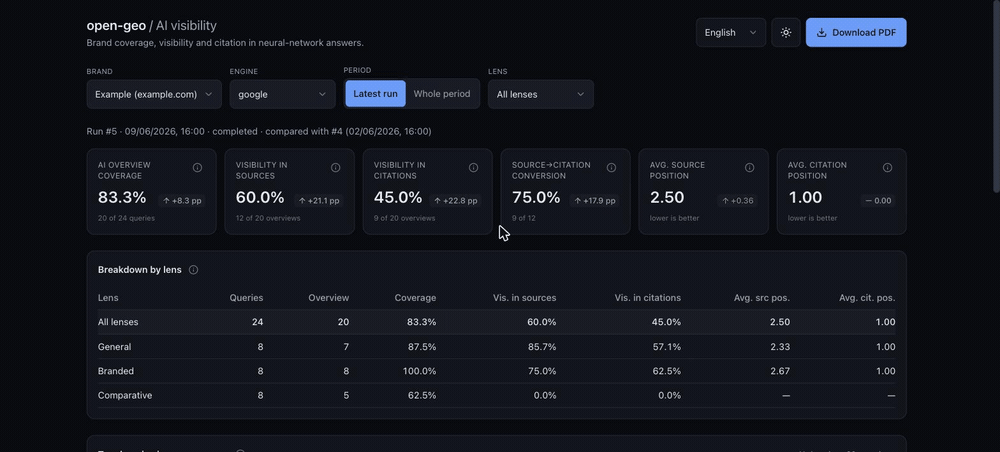
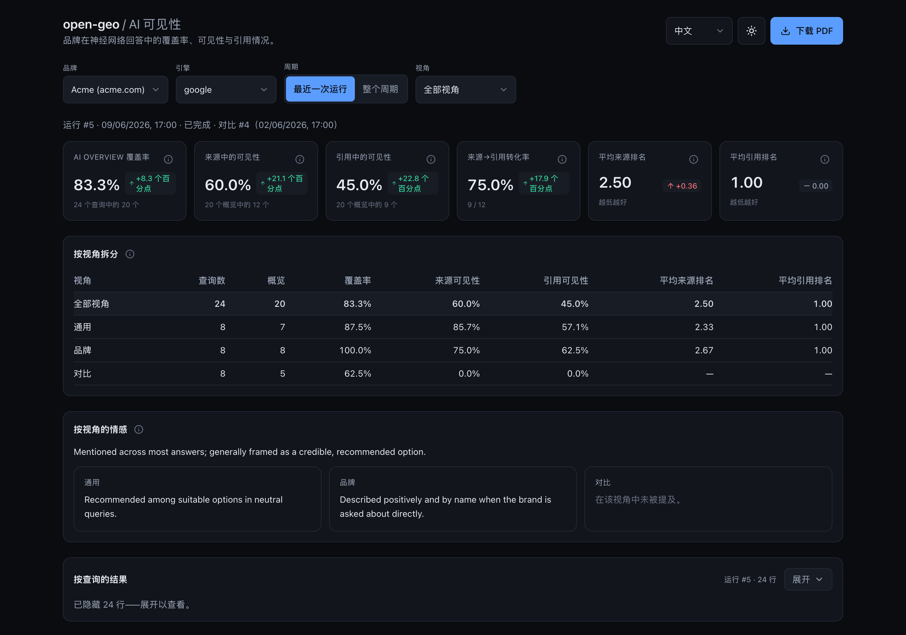

<p align="center">
  
</p>

<p align="center"><a href="README.md">English</a> · <a href="README.ru.md">Русский</a> · <a href="README.zh.md">中文</a> · <a href="README.ar.md">العربية</a></p>

# open-geo — 面向 Claude Code 的 GEO 可见度追踪器

**open-geo 衡量你的品牌在 AI 回答_内部_的可见度——覆盖每一个主流引擎。**
搜索正在从「十条蓝色链接」转向生成式回答：ChatGPT、Perplexity、Gemini、
Claude、Google AI Overview、Yandex、DeepSeek。每条回答都依赖少数几个来源——而
成为其中之一**就是**在 AI 中的可见度。open-geo 在一个真实、已登录的浏览器里把你的查询跑过某个引擎，
并记录你的域名是否进入了**来源**、是否进入了**引用**、是否进入了**正文**——
以及当它出现时品牌是如何被谈及的。

[](https://github.com/Pupok462/open-geo/actions/workflows/ci.yml)
[](https://claude.ai/code)
[](https://www.python.org/)
[](LICENSE)

<p align="center">
  
</p>
<p align="center"><sub>演示品牌上的仪表盘——KPI 漏斗、按视角细分、热门域名排行榜。</sub></p>

### 为什么选 open-geo

- **它像人一样读回答，而不是像 API。** 捕获过程通过 Claude-in-Chrome 在一个
  真实、已登录的浏览器里运行——它看到的是_渲染后_的 AI 回答（来源面板和正文中的
  引用标记），对域名做归一化处理，并为每个查询输出一条经过校验的记录。通过 API 或
  headless 抓取拿到的，与真实登录用户实际看到的并不一致；而这个一致。
- **会自适应，而不是会崩。** 捕获是一个沿着自然语言 playbook（`engines/<engine>.md`）
  奔向目标的代理，而不是写死的选择器：当某个引擎改版时，代理自行适应，而结构性变化
  只是 markdown 文件里改几个字。正因如此，添加一个引擎（比如大多数工具都跳过的
  Yandex / Alice）才很便宜。
- **一条可见度漏斗，而不是虚荣指标。** 六项指标层层嵌套成一条漏斗——回答 →
  来源 → 引用——外加一项定性的情感判读**以及一个热门域名排行榜**（你的品牌与回答中所有其他域名的对比）。
  **没有综合指数，没有编造的 share-of-voice 指数。** 每个数字都可追溯到 [`pipeline/INTERFACES.md`](pipeline/INTERFACES.md) 进行审计。
- **本地优先、多品牌时间序列。** 捕获结果落入本地 SQLite（WAL）数据库，于是你可以
  构建按品牌、按引擎的历史，并得到逐次运行之间的差值。交付物是一份带主题的 **PDF** 和
  一个**带四语言切换器的 FastAPI + React 仪表盘**。没有 SaaS、无需账户——由你自己运行，方法论你可随时查看与复现。

### 这是给谁用的

- **GEO / SEO 顾问** —— 带着对某个品牌 AI 回答可见度的真实、_带日期_的判读走进提案现场，
  而不是「AI 搜索很重要，相信我」。
- **品牌内部增长 / SEO** —— 持续追踪你自己域名在 AI 回答中的出现情况，
  按查询视角（general / branded / comparative）拆分，并捕捉逐周的漂移。
- **自建 AI 可见度测量的团队** —— 把 open-geo 当作基准：你的 API / 抓取流水线
  与渲染后回答里真实呈现的内容是否相关？
- **已经在用 Claude Code 的创始人和开发者** —— 它就是一个技能：把 `/open-geo` 指向一个 CSV 和一个
  域名，得到一个仪表盘。没有 SaaS，无需上传，无需账户。

## 你会得到什么

- **AI 回答的捕获** —— 一列查询在一个真实、已登录的浏览器里被跑过某个引擎，
  目标域名如何出现会被记录下来，每个查询一条经过校验的记录。
- **六项指标 + 定性情感** —— 一条可见度漏斗（回答 → 来源 → 引用）：
  覆盖率，针对来源*和*引用各自的可见度比率与平均最佳位置，外加
  来源→引用的转化率（`relative_citation`），以及一条关于每条回答如何对待品牌的简短自由文本注记。
  仪表盘和 PDF 还会展示一份从这些逐查询注记综合而成的**按视角分组的定性情感
  摘要**（见 **指标**）。
- **热门域名（竞争对手）排行榜** —— 把平均位置这一指标从你的品牌推广到回答中出现的*每一个*域名，
  按出现频次排序（并附其平均来源/引用位置）。这是诚实的「谁在与你共享回答空间」——品牌竞争对手与
  发布方/聚合站一视同仁，你的品牌高亮显示——以仪表盘中的可排序面板和 PDF 中的一节呈现。无需额外抓取：
  它由你已采集的数据算出，因此对历史运行同样有效。
- **SQLite 多品牌时间序列** —— 每次运行都存入 `data/aeo.db`（SQLite，WAL），
  于是你能按品牌 + 引擎累积历史，并得到逐次运行之间的差值。
- **带四语言切换器的仪表盘** —— English、Русский、中文、العربية（支持 RTL）——
  FastAPI 只读 API + 一个 Vite/React 前端，带浅色/深色主题和逐指标的悬浮提示。
- **PDF 报告** —— 一份自包含的带主题 A4 报告（ReportLab + matplotlib），无需 headless
  Chrome，也不需要系统库。

## 快速开始

open-geo 是一个 **Claude Code 技能**——你从与 Claude 的对话中驱动它，而不是从一堆
shell 命令。整个上手流程是：克隆、让 Claude 安装它，然后把它当作命令来用。

1. **克隆仓库**（或者直接把 Claude 指向 URL）：

   ```bash
   git clone <repo> open-geo
   ```

2. **让 Claude 帮你完成设置。** 在该文件夹下的 Claude Code 会话里，说类似这样的话：

   > 设置好 open-geo（运行 `scripts/setup.sh`），然后用 `examples/questions.csv`
   > 在 `google` 上追踪 `example.com`（品牌为 "Example"）。

   Claude 会替你执行安装和捕获——并打印出一个仪表盘链接和一份摘要。

3. **或者在安装后直接以命令运行：**

   ```bash
   /open-geo examples/questions.csv google example.com --brand "Example" --n-worker 3 --output both
   ```

> **`examples/questions.csv` 只是占位样例**——一个虚构品牌的问题集，让首次运行开箱即用。正式判读前，请换成
> **你自己的**查询：问题集是核心输入，它决定*测量什么*，报告的质量取决于你所提问题的质量。格式与如何挑选见
> FAQ「我需要什么输入？」。

**也可以作为 Claude Code 插件安装** —— 在任意会话中注册该命令及其工作代理：

```
/plugin marketplace add Pupok462/open-geo
/plugin install open-geo@open-geo-marketplace
```

> 插件技能带命名空间：通过插件安装后命令为 **`/open-geo:open-geo`**（从仓库克隆中使用时仍是
> `/open-geo`）。插件只是安装入口：流水线本身仍需从仓库克隆中运行（见上文步骤 1–2），若在克隆
> 之外调用，命令会明确提示这一点。之后可用 `/plugin update open-geo` 获取新版本。

**按计划追踪。** 用 Claude Code 的 **`/loop`** 把命令包起来，以一定间隔重新捕获并
观察漂移——例如做一次每周的判读：

```bash
/loop 1w /open-geo examples/questions.csv google example.com --brand "Example" --output both
```

> 唯一一件 Claude 无法替你做的事：连接 **Claude-in-Chrome** 扩展，并把浏览器
> 登录到你想追踪的市场。捕获所驱动的，正是那个已登录的会话。

## 命令

一切都通过**一个**操作员命令运行——即 **`/open-geo`** 技能。你不用碰
Python：Claude 编排捕获 → 指标 → 交付物，并把一个仪表盘和/或一份 PDF 交到你手里。

```
/open-geo <questions.csv> <engine> <domain> --brand "<name>" --n-worker <N> \
          [--output dashboard|pdf|both] [--period today|all] [--lang en|ru|zh|ar]
```

| 参数 | 含义 |
|---|---|
| `<questions.csv>` | 含列 **`query,lens`** 的 CSV，其中 `lens ∈ general \| branded \| comparative`。现成样例：`examples/questions.csv`。 |
| `<engine>` | 要追踪哪个 AI 引擎（如 `google`）。同一个位置可接受任何在 `engines/` 下有捕获 playbook 的引擎。 |
| `<domain>` | 目标域名（任意写法：`https://www.example.com`、`example.com`——会被自动归一化）。 |
| `--brand "<name>"` | 人类可读的品牌名（用于报告/仪表盘标题和摘要）。 |
| `--n-worker <N>` | **并行**运行的捕获 worker 数量——即本次运行的并发度。 |
| `--output` | `dashboard`（默认）\| `pdf` \| `both`。 |
| `--period` | `all`（默认——完整的品牌+引擎历史，启用差值）\| `today`（仅本次运行）。 |
| `--lang` | 交付物的 UI 语言——`en`（默认）\| `ru` \| `zh` \| `ar`。 |

它端到端做了什么：创建一次运行 → 把查询分摊到**并行**的捕获 worker（
每个 worker 在你已登录的 Chrome 里驱动引擎，并为每个查询返回一条经过校验的记录）→
集中地摄入并打分 → 输出仪表盘和/或 PDF → 从跨视角的 `all` 行打印一份简短摘要。
通过 `/loop` 重新运行，即可随时间追踪漂移。

## 工作原理

整个追踪器由 **`/open-geo`** 命令编排：

1. **捕获 playbook** —— 一份按引擎划分的 playbook（`engines/<engine>.md`）由
   **Claude-in-Chrome** 在一个**可见、已登录**的 Chrome 中驱动。它像 LLM 那样读取渲染后的 AI 回答，
   展开来源面板和正文中的引用标记，对域名做归一化，并为
   **每个查询输出一个 `QueryCapture` 对象**。
2. **`QueryCapture`** —— 经过校验的捕获契约（Pydantic v2；权威规范见
   [`pipeline/INTERFACES.md`](pipeline/INTERFACES.md)）。
3. **摄入 / 打分** —— worker 是**仅负责捕获**的：每个 worker 构建并自校验它的
   记录（只读），然后把它们**返回**给编排器。**编排器（即技能）**
   独占所有数据库写入：每个 worker 一返回，它就**立刻摄入那一块**（增量式，因此运行中途
   崩溃也不会丢失已捕获的内容），敲定本次运行，再按视角计算指标外加一行 `all`。
4. **仪表盘 / PDF** —— 编排器**最后**才从已存储的指标输出交付物，
   外加一份简短摘要（仪表盘服务器只在所有捕获都就绪后才启动）。

该流水线是**引擎无关的**：`engine` 端到端都是一个开放 id（契约、数据库、CLI、
仪表盘、报告），而支持一个新引擎主要就是一份新的 `engines/<engine>.md` playbook——
见 [`engines/README.md`](engines/README.md)。

## 指标

**用大白话讲这条漏斗。** 这四个计数在每一步逐级收窄：

- **Queries** —— 你喂进去的问题（你的 CSV）。
- **AI Overview** —— 引擎确实生成了 AI 回答的那些查询（它并不总是生成——
  而缺失是有效数据，不是失败）。
- **In sources** —— 在上述查询中，你的域名进入了回答所依赖的**来源**的那些查询。
- **Cited** —— 在上述查询中，你的域名确实在回答正文里被**链接/引用**的那些查询。

每一步都是前一步的子集，因此这些计数层层嵌套：
`n_cited ≤ n_in_sources ≤ n_overviews ≤ n_queries`。（引用是来源的子集，因为
模型只能引用它检索到的内容。）**可见度的分母是「回答存在」的查询**
——你只能在确实渲染出回答的地方才谈得上可见。一切都**按视角**计算
（`general` / `branded` / `comparative`），外加一行汇总的 `all`。

这六项指标无非就是沿着那条漏斗的比率与位置：

- **`overview_coverage`** —— 总共有多大比例的查询产生了 AI 回答
  （`n_overviews / n_queries`）。
- **`visibility_in_sources`** —— 在有回答的查询中，你的域名进入所
  依赖**来源**的比例（`n_in_sources / n_overviews`）。
- **`visibility_in_citations`** —— 在有回答的查询中，你的域名在
  回答里被**引用**的比例（`n_cited / n_overviews`）。
- **`avg_source_position`** —— 在你的域名出现的那些查询上，它在来源中的平均最佳（`min`）名次，
  （**越低越好**；若从未出现则为 `—`）。
- **`avg_citation_position`** —— 在你的域名被引用的那些查询上，它在引用中的平均最佳（`min`）名次，
  （**越低越好**；若从未被引用则为 `—`）。
- **`relative_citation`** —— **来源→引用的转化率**：在你被
  检索进来源的那些查询中，模型实际引用了你的比例（`n_cited / n_in_sources`；
  **越高越好**，取值在 `[0, 1]` 之间）。
- **sentiment** —— 每个查询一条简短的**定性**短语，描述回答如何对待
  品牌。它是**自由文本，不是数字**。在最终敲定时，编排器还会把这些逐查询
  注记汇总成一份**按视角分组的摘要**（每个视角一行短句，外加一段 `all` 综合），在仪表盘中显示为
  「Sentiment by lens」条带，并作为 PDF 情感章节的开头。它
  跟随被捕获数据的语言，而不是 `--lang`。

一个**热门域名排行榜**（INTERFACES §4.2）按出现频次与平均来源/引用位置对回答中的每个域名排名
（你的品牌高亮）——由同一批采集数据算出的诚实竞争语境。仍然刻意**没有综合指数、没有 share-of-voice
指数、也没有数值化情感**——排行榜只是频次与位置，而非混合分数。 运行之间的**差值**
在读取时针对同一品牌 + 引擎的上一次已完成运行计算得出；
它们不被存储。权威：[`pipeline/INTERFACES.md`](pipeline/INTERFACES.md) §4。

## 示例输出

每次运行产出两件交付物——一份带主题的 **PDF 报告**和一个本地**仪表盘**，二者
都从同一次打分后的运行构建而来。

PDF 的**关键指标页**（来自预置的 **Example** 演示——引擎 `google`；
[下载完整示例 PDF](assets/sample-report-example.pdf)）：

<p align="center">
  
</p>

**仪表盘** —— 带读取时差值的 KPI 卡片、按视角的拆分、一个「Sentiment by lens」
条带、一个**「Top domains in answer space」排行榜**、一张回顾图表和一张逐查询表格，配有四语言切换器和浅色/深色
主题：

<p align="center">
  
</p>

在一次运行结束时，`/open-geo` 会从 `lens="all"` 行构建并打印一份简短的标题摘要
（此处为预置的 Example 演示——引擎 `google`，2026-06-09 的运行）：

```
Run for brand "Example" (engine google), queries: 24.
• AI Overview coverage: 83% (20 of 24 queries).
• Visibility in sources: 60% of overview queries.
• Visibility in citations: 45% of overview queries.
• Average source position: 2.5 (lower is better).
• Average citation position: 1.0 (lower is better).
• Source→citation conversion (relative citation): 75% (higher is better).
```

`lens="all"` 的六项指标，连同底层的漏斗计数
（`n_queries = 24` → `n_overviews = 20` → `n_in_sources = 12` → `n_cited = 9`）：

| Metric | 取值 | 大白话含义 | 方向 |
|---|---|---|---|
| `overview_coverage` | **0.83** (20/24) | 总共有多大比例的查询渲染出了 AI 回答 | 越高越好 |
| `visibility_in_sources` | **0.60** (12/20) | 在有回答的查询中，`example.com` 进入所依赖来源的比例 | 越高越好 |
| `visibility_in_citations` | **0.45** (9/20) | 在有回答的查询中，域名在回答正文里被引用的比例 | 越高越好 |
| `avg_source_position` | **2.50** | 在域名出现的查询上，它在来源中的平均最佳（`min`）名次 | 越低越好 |
| `avg_citation_position` | **1.00** | 在域名被引用的查询上，它在引用中的平均最佳（`min`）名次 | 越低越好 |
| `relative_citation` | **0.75** (9/12) | 来源→引用的转化率（漏斗最后一步，∈ `[0, 1]`） | 越高越好 |

当某项的保护条件触发时，它会渲染为 `—`（而不是 `0`）——例如在本次运行中，`comparative` 视角下
域名从未进入来源，于是三项来源/引用指标全都是 `—`。

## FAQ

### 我需要什么输入？
**你自己的一份问题清单**——一份**含两列 `query,lens` 的 CSV**，其中 `lens ∈ general | branded |
comparative`（`general` = 不点名品牌的中性查询；`branded` = 显式点名品牌；`comparative` = 品牌对比
其他选项）。这份文件由你撰写，而且**它是最重要的输入**：GEO 可见度是*相对于你所提的问题*来衡量的，
因此整份报告的质量取决于问题集的质量。写下你真实客户会输入的查询，并在三种 lens 间保持均衡（每种几条
即可起步）。随附的 [`examples/questions.csv`](examples/questions.csv) 只是某个虚构品牌的**占位样例**——
用它了解格式，然后替换成你自己的。

**还没有清单？open-geo 可以为你采集一份。**如果你不传入 CSV，向导会提供**生成一份有据可依的问题集**
（question harvesting）：侦察子代理会围绕你产品的多个角度（需求、供给、品类、口碑、对比）收集真实的、
有信号支撑的用户查询，一个质疑者子代理会剔除任何凭空捏造或标错 lens 的条目，最终得到一份 `query,lens`
CSV 以及一份说明*为什么是这些问题*的 `*_rationale.md`——在正式运行前由你审阅（采用／编辑／丢弃）。它是
**有据可依而非凭空捏造**的（每条查询都可追溯到一个可观察信号），并且完全**可选**——你自己手写的 CSV
始终是一等输入。流程详见 [`harvest/METHODOLOGY.md`](harvest/METHODOLOGY.md)。

### 我需要任何付费 API 密钥吗？
不需要外部数据 API，也不需要付费密钥。你需要 **Claude Code**、已连接的 **Claude-in-Chrome**
扩展，以及一个**已经登录**到你想追踪的引擎 / 市场的浏览器。

### 有云服务或账户吗？
没有。open-geo 是本地工具：每次运行都存入位于 `data/aeo.db` 的本地 **SQLite（WAL）数据库**，
交付物是一份**本地 PDF** 和一个你自己运行的**本地仪表盘**。没有 SaaS，也没有账户，方法论你可
随时查看与复现。（捕获本身经由 Claude Code / Claude-in-Chrome，因此它并非离线 / 气隙工具。）

### 为什么是六项指标而没有单一分数？
因为它们构成一条**漏斗**（回答 → 来源 → 引用），而把它压成一个数字
会招来含糊的加权和臆造的基准。每个数字都可追溯到
[`pipeline/INTERFACES.md`](pipeline/INTERFACES.md) §4 中的某一个公式进行审计，外加一条永远
不被压成数字的自由文本情感注记。一个热门域名排行榜（§4.2）以频次 + 位置提供竞争语境——但仍然
没有综合指数，也没有 share-of-voice 指数。

### `--n-worker` 是什么，一次运行要多久？
`--n-worker N` 是本次运行的**并发度**：查询被切成 N 个分块，N 个捕获
子代理**并行**运行，每个在自己的浏览器标签页/上下文里。一次单查询捕获大约是
6–10 次工具调用，所以墙钟时间随每个 worker 顺序处理多少个查询而变化——
调高 `--n-worker` 可以缩短一次大规模运行（在合理范围内，以保持在引擎的
「异常流量」雷达之下）。

## 许可证

MIT。
